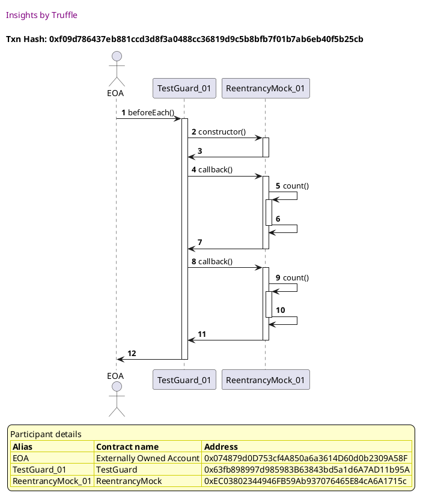
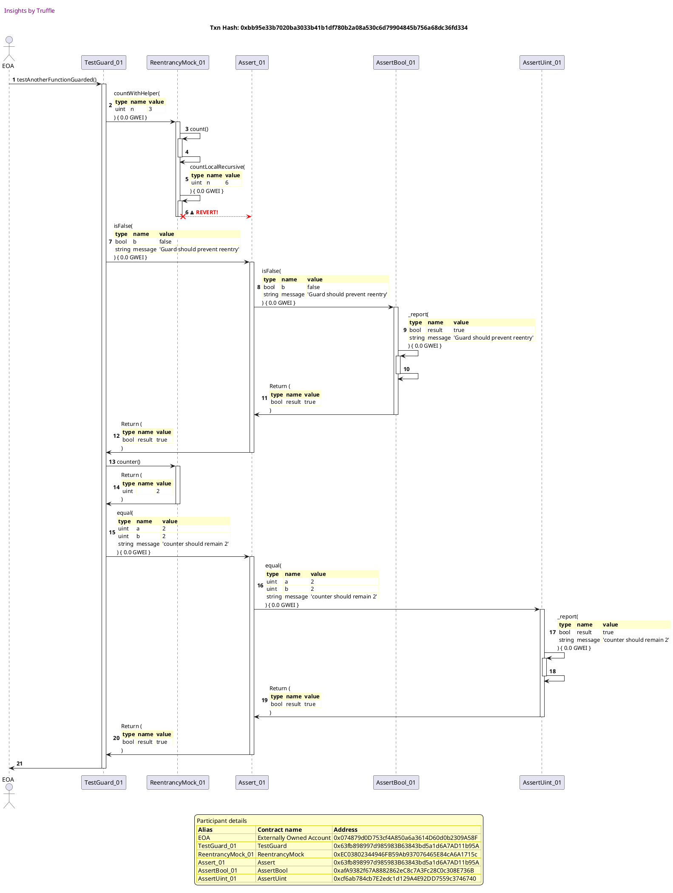

Test date: 2021 Mar 03

## Another Function Guarded
[link to test...](https://github.com/cds-blog-code-samples/Reentrant/blob/master/test/TestGuard.sol#L100)

##### d1, tx: 0xf09d786437eb881ccd3d8f3a0488cc36819d9c5b8bfb7f01b7ab6eb40f5b25cb

[SVG :telescope:](https://www.planttext.com/api/plantuml/svg/xLJBZjem5DtxAwoPJQifgeCTnqOKJO3GwQAQKSk-yYiG4HpaE2fCf_zU4rB4ewqq-sRXnEVUU-v3zmI0-zeBvvjr2O1eV6MRjJGErAl2ReGJQrYQXR5wBDHguQh6wabLLWxUph9PDia06DP-LveHWEspD48R1tzqLmWVAbSyLzQBCYsBXLqRwmDZxeyEis0yK6uQjodDcU5hyMnWH8xOaz2wi0iOeGxwsRw7xxiYG9V_awsBnTBNKExWt3Lv7dY1Btnfu7nhuOEebmE8jZdYEc6KuCH8nYAbDDOinm8HnfJ2b4LSSnLB9dEPv2YIYP3KI8BoMFPZ9K4OcVAXzEmnXQA6D-5z0yBOVA6AZGYjpatjFpR2wMyeQZrEWNFNBoRCnWchTfyhjVhjVuNU0D2cWRtH1Hkyknj0QVBAcKoevPktuCA-ZxZcQyDKPMllcdqp-xW_U5sdw_K6y3KfH5dAi4N_uFzhSOtrhmixrFQ_3TZjoju83ae6JoTBfuqNHLc3OQVdTxTJD4K8ZLu-m23Oi87XOrBjqoiFhLYRFP1gxKmTRCUuqKkhWN1klN4sp6W77xzRes6gshw32MrHGbZ2DPecCLOvILcC11MOHcHAaKQoZn5FOpOx9pxJqCcrfQGubumppXFDMSmP7bFC29Ow5f6cQP9EeqZoE3sdlDRQ9TQIPnE46UfZGZYXit7CKybnWX9AQ9mnebAQHaaKgq0U1jkD5zo7C_nEVm40)

##### d2, tx: 0xbb95e33b7020ba3033b41b1df780b2a08a530c6d79904845b756a68dc36fd334

[SVG :telescope:](https://www.planttext.com/api/plantuml/svg/vLTjRzis4FwkNy6bmDgaoqg9Ug42pwXioqs13YsyRFsm3WL5KhOGcV8eAhLRxx_t9CkExJZhIx82nGnR58-dXyzpEfrFblMqD4oRQffR5gjCeQff8hLLNcPgnZIReboEfH8znY_7kgYKw1TveT63OJoC-x5bTKgpo6NNGird8fcG6drefmYT5pfxNoZ3yYZFncegbG74r6mSXh2uWfnLUfRBdONVilSIsUx6zee9aQanid5h-gSPEqzQ4bQx_tDLPkE9AL6oG1UwIbF0jKncSeakvWgTit9oXl0yIK9F4f84sC498nXENJknHHfGd3WCK-OHp7qHX25sgUibWUSpdmfE_5GGubeGCcw0UlmoGgn4Hp0UMH0sa_5ina3gXIpDiuffyHRRZSUsOTTr924scYc--BNWbsl_6zRTYwAobDgidJUpGqwzeiXt7LlB8UVVCxM7sbgEBAjHYKwxUsBGuyTdo80bKeMPI3si53TPeHe7AHuTMtl-DS9DUGqCXqGphpCpEPVvJEf7RzGRgzEct4_js5t-WinY9X6CYasRyOhb5PpKxajK0MEqH0f-P6KxHXyG_XcZPw_Zvv0wXtR_5AbQnkTVTdfwXhvgcnS5P_b8yagNsPMyitx_i_NFJ_zyeANugoPudKwDaCwFxvXMyFXrKOUlYW1uTazEHl4VyUZYXvEJpfF6thM4XESYks967ipWJomVo9CjAdMCidB8yl8huv90saDC4lYbDShQNXfTrvObcigoP6EmeuSD2rHEYYeNQARbLLs_T4DvyV1mKBUZrjr_rBuJzXkwjoXug-MiqEPE2hGigxnEKAEhRwzYzMJUwhVn6KbJQONkM-dnZJpPo_d_TEilgyDGVsylUlTCkwrPy7N-XUrUDP1_Loo_qtxiUiEDBTcs7ShBDZZhpDHooZA5d2yf2-i_rUzDneRtBLA-QNsuRm7RfU60t_-jDAowlJecrkfLm7grrIuAQLYMbrii1dY0CQvPGCSF_IESz8kwT72puHC90Tl3skQwxh9fek4uXtkfM9ulqCjtIWeKyUO6mnAUuy2bGIZm8F08Jzs8UfZvZFYsE_2nW9wTu33ow70NUAS9tvesa3v94nhIC0n4IBsGafvFg4iIuJ5R-54G3MmRNXEYNSYRpVg-hG6F-vXGx13N3Lr_sFF2A0b9W0FVzRsOkZpo8pkmFRuBVjtKhy_lm7It-T-UDw0iZK92dTGF8agfGtr7zYaF8ZBa3krZJZ2D0-Bt3e6kNnAsvmqeJtsM1A0l2M972cuBsmaZDmwT0TmvB-GaSFt0nG0A-THcbVKKZl0Q-X40)

