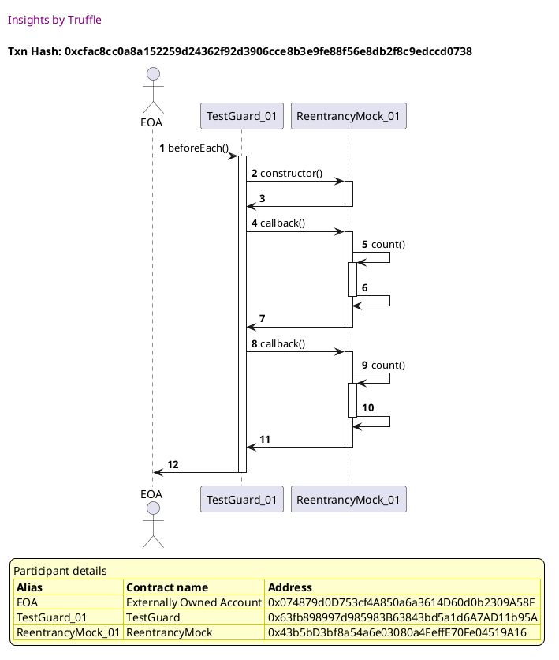

Test date: 2021 Mar 03

## Another Function Vulnerable
[link to test...](https://github.com/cds-blog-code-samples/Reentrant/blob/master/test/TestGuard.sol#L88)

##### d1, tx: 0xcfac8cc0a8a152259d24362f92d3906cce8b3e9fe88f56e8db2f8c9edccd0738

[SVG :telescope:](https://www.planttext.com/api/plantuml/svg/xLJ9Rjim4BtpAuZaqY8rIebQo20reiHsqqEHeCsz6953MuXC6HI5scdwxwKLDV3I5iYzEb3Ycvat2-Q9aClMW_FTiYO4Ej_ORbcY8-r3PLVWO4bhdAFLLw0UvgxfhBvkwiRHqzbqDhsU4dBH-asDOqBxPu6WqT4VmvNIcyPLZutrK1TrDRTBj3um6l_YC0l6PyfLvrOrxXc-Lez8e-G5kmEjApkd4HkWd_txulrG11doVx9jDL_ubfORUkywOm8lyPMlaTwlBRs1Td5EsLePK48f1WAYD8vJgUE4Px6HiUQIPKgXA3bAWqAOD4EXozW89L4hfLdE1GaZKpwKFhqjABJq9BnFI1YRhrIrWj3gFRR-OmTEVsDHxx4BxBj-mJ0R1rPjFZVguRV_4Nf2I9-6ZiO7RFJix9oMQ1g7Kr2BDs_9WNqRSSpNXwd6jjvrssQsSN_mEaut6ftJrwI0kYx35ls3_w_5TTQ_Bkovjlzjq65NjaRoh6HojxDq6ZrKTKik1Zs_Evsm2MDi_FI11i663GmVryqslVBKmXAtGA6rmpRONkB6Jxq6mhdsw6oOqORUVhUeQQ7wleE9hLcUY5ngDibJhanIY9H11ZoBaad6D2jZpcIHYja-yPw6TguzPSPDAQIGCjTIf5BmguoBX9SwXKXdHLvCegYKQR5FUQorGwmd3pnfEU6b4P0ca27ZJ318PcZCD6SpP4aQoIBA0daOx31USXdEy3lz1G00)

##### d2, tx: 0x30cab2f7739d2f5b8af75905f22ebcaa8ad3e7b2f3d4566533632dc3a18b6150

[SVG :telescope:](https://www.planttext.com/api/plantuml/svg/xLfjRzis4FwkNq5a7xgWoqQ9Ug62BAWIsqs13IsoRFrIeA18oXP2Knv5PN7h_VTHigJ8B-cM9YjMZ0PicgVZyRb7vyF9FCTvKMgYT3KNZaCgNSXgddBbbDUvN115va3mAPViZD3hgIegoSuBKIZmpMGy6P-F7UUar4l1JntGl6QSCAx0ntOAm4MXyW-5r4Ga8f_AEPVQMCnqhp0n5zSc5vLQ2BvnuPVy0mUktylU4CPoEGKkR4L_DkF93oq8fzt_bIppwKoN85s2ArLbcR7hw5mB3gvk9RWWvUmOm5i4AKczB8fGpBmiI379eY26GUPvFAM4OC8GZum6OduGXW528V8OHSJ5QUW6q36KKMsWZrydW9JWm8m7Zg5DvpHV4EFg5I_roueezXwwZSPGiAbwoGqtYaYw_BcWrvt-ZdHpKLAMNEbEkP_jKpeh2h6fs4hsAV-QooshhUJ0SHelmT7fbZFW-VDZe8qaaOMUSJMf9DLv8N-hXEIAf89_U-XiBQcDx7hOMA8crlJRNCykk5XmDR3oJhvpJjhu-wuTJrS_0hrSS616IURDU4D4PRxKwYjG6VXW1QHvkt0jF0GV0VmUWfTlnwzC8Eq3ydVuQe_--RAZesFmMTlyL50YBZcjL9dVy2UamhDKz54HMoewAh2begCYibHqL8IMYewAm5BHKU5RAZegaAMYeyApL7HKk9OAMtXlKs6BpOu9MsjsJDXIisF2LfeT4xRGx9YmTMR7X2qp-x-lB1DTQMMPQ9buT8tvK9UiljMt-b-9_jRnKwEwUoHrTuxM9Aoyl5BLPsQcj2Y4oKgfUMjr9owrgiynLs3Eov9CZHmy6nMy1BBGO4PkE21WMcDwjZ-T3H3U0UxEy_xRe7kKzm1_h_YYKFfHo1KlAw6_EFnrFDshr-jSSbqf2PxQnSETkDWDztzlwuUTx7BrYKBZYM6trK5TCA9FmDtwrVFVAo8UjI4PxDWBqmtXlfXi-G7bhAW4CspFIIxDceUaWkwq_Ylqf8T-ZpTVD3yykGV35B57x_-M8jQj93KdphhFo7apw4LXN9DSb0CK8pY24DOe4f6Jijx-lAXJ2DKzdeGnixsvrgyxNJKTEkRprjnCIOHOWjT_ICv0GfixN3yttCB8nr7Cu2WA4Cty10UGX0I5hZyA8OEfXs2S17YoQNYZmsSmRKo6A4jnZECuOZ4EOepEGeHzbBA0k2nCecJakcaS99icTpk1jcMDSMCdI4SepJ09V19oY226n9_mB1j7SCAX7xXnKX_R3etVTGnrtn-1TBEpQ3XlZ98iYH7siZ1ACCOU3Zr-ZccKe0dry3ca1l0uGk7PFgDT1z9mtXYbMKZI2FiqZSOUPzHbhXSd_ZZsHkRE1J55aHz6ldaET4myjL7bl32VrLpy1G00)

```plantuml


@startuml

autonumber
skinparam legendBackgroundColor #FEFECE

<style>
      header {
        HorizontalAlignment left
        FontColor purple
        FontSize 14
        Padding 10
      }
    </style>

header Insights by Truffle

title Txn Hash: 0x30cab2f7739d2f5b8af75905f22ebcaa8ad3e7b2f3d4566533632dc3a18b6150


actor EOA as "EOA"
participant TestGuard_01 as "TestGuard_01"
participant ReentrancyMock_01 as "ReentrancyMock_01"
participant Assert_01 as "Assert_01"
participant AssertBool_01 as "AssertBool_01"
participant AssertUint_01 as "AssertUint_01"

"EOA" -> "TestGuard_01" ++: testAnotherFunctionVulnerable()
"TestGuard_01" -> "ReentrancyMock_01" ++: countWithHelperVulnerable(\n\
<#FEFECE,#FEFECE>|= type |= name |= value |\n\
| uint | n | 10 |\n\
) { 0.0 GWEI }
"ReentrancyMock_01" -> "ReentrancyMock_01" ++: count()
"ReentrancyMock_01" -> "ReentrancyMock_01" --: 
"ReentrancyMock_01" -> "ReentrancyMock_01" ++: countLocalRecursiveVulnerable(\n\
<#FEFECE,#FEFECE>|= type |= name |= value |\n\
| uint | n | 20 |\n\
) { 0.0 GWEI }
"ReentrancyMock_01" -> "ReentrancyMock_01" ++: count()
"ReentrancyMock_01" -> "ReentrancyMock_01" --: 
"ReentrancyMock_01" -> "ReentrancyMock_01" ++: countLocalRecursiveVulnerable(\n\
<#FEFECE,#FEFECE>|= type |= name |= value |\n\
| uint | n | 19 |\n\
) { 0.0 GWEI }
"ReentrancyMock_01" -> "ReentrancyMock_01" ++: count()
"ReentrancyMock_01" -> "ReentrancyMock_01" --: 
"ReentrancyMock_01" -> "ReentrancyMock_01" ++: countLocalRecursiveVulnerable(\n\
<#FEFECE,#FEFECE>|= type |= name |= value |\n\
| uint | n | 18 |\n\
) { 0.0 GWEI }
"ReentrancyMock_01" -> "ReentrancyMock_01" ++: count()
"ReentrancyMock_01" -> "ReentrancyMock_01" --: 
"ReentrancyMock_01" -> "ReentrancyMock_01" ++: countLocalRecursiveVulnerable(\n\
<#FEFECE,#FEFECE>|= type |= name |= value |\n\
| uint | n | 17 |\n\
) { 0.0 GWEI }
"ReentrancyMock_01" -> "ReentrancyMock_01" ++: count()
"ReentrancyMock_01" -> "ReentrancyMock_01" --: 
"ReentrancyMock_01" -> "ReentrancyMock_01" ++: countLocalRecursiveVulnerable(\n\
<#FEFECE,#FEFECE>|= type |= name |= value |\n\
| uint | n | 16 |\n\
) { 0.0 GWEI }
"ReentrancyMock_01" -> "ReentrancyMock_01" ++: count()
"ReentrancyMock_01" -> "ReentrancyMock_01" --: 
"ReentrancyMock_01" -> "ReentrancyMock_01" ++: countLocalRecursiveVulnerable(\n\
<#FEFECE,#FEFECE>|= type |= name |= value |\n\
| uint | n | 15 |\n\
) { 0.0 GWEI }
"ReentrancyMock_01" -> "ReentrancyMock_01" ++: count()
"ReentrancyMock_01" -> "ReentrancyMock_01" --: 
"ReentrancyMock_01" -> "ReentrancyMock_01" ++: countLocalRecursiveVulnerable(\n\
<#FEFECE,#FEFECE>|= type |= name |= value |\n\
| uint | n | 14 |\n\
) { 0.0 GWEI }
"ReentrancyMock_01" -> "ReentrancyMock_01" ++: count()
"ReentrancyMock_01" -> "ReentrancyMock_01" --: 
"ReentrancyMock_01" -> "ReentrancyMock_01" ++: countLocalRecursiveVulnerable(\n\
<#FEFECE,#FEFECE>|= type |= name |= value |\n\
| uint | n | 13 |\n\
) { 0.0 GWEI }
"ReentrancyMock_01" -> "ReentrancyMock_01" ++: count()
"ReentrancyMock_01" -> "ReentrancyMock_01" --: 
"ReentrancyMock_01" -> "ReentrancyMock_01" ++: countLocalRecursiveVulnerable(\n\
<#FEFECE,#FEFECE>|= type |= name |= value |\n\
| uint | n | 12 |\n\
) { 0.0 GWEI }
"ReentrancyMock_01" -> "ReentrancyMock_01" ++: count()
"ReentrancyMock_01" -> "ReentrancyMock_01" --: 
"ReentrancyMock_01" -> "ReentrancyMock_01" ++: countLocalRecursiveVulnerable(\n\
<#FEFECE,#FEFECE>|= type |= name |= value |\n\
| uint | n | 11 |\n\
) { 0.0 GWEI }
"ReentrancyMock_01" -> "ReentrancyMock_01" ++: count()
"ReentrancyMock_01" -> "ReentrancyMock_01" --: 
"ReentrancyMock_01" -> "ReentrancyMock_01" ++: countLocalRecursiveVulnerable(\n\
<#FEFECE,#FEFECE>|= type |= name |= value |\n\
| uint | n | 10 |\n\
) { 0.0 GWEI }
"ReentrancyMock_01" -> "ReentrancyMock_01" ++: count()
"ReentrancyMock_01" -> "ReentrancyMock_01" --: 
"ReentrancyMock_01" -> "ReentrancyMock_01" ++: countLocalRecursiveVulnerable(\n\
<#FEFECE,#FEFECE>|= type |= name |= value |\n\
| uint | n | 9 |\n\
) { 0.0 GWEI }
"ReentrancyMock_01" -> "ReentrancyMock_01" ++: count()
"ReentrancyMock_01" -> "ReentrancyMock_01" --: 
"ReentrancyMock_01" -> "ReentrancyMock_01" ++: countLocalRecursiveVulnerable(\n\
<#FEFECE,#FEFECE>|= type |= name |= value |\n\
| uint | n | 8 |\n\
) { 0.0 GWEI }
"ReentrancyMock_01" -> "ReentrancyMock_01" ++: count()
"ReentrancyMock_01" -> "ReentrancyMock_01" --: 
"ReentrancyMock_01" -> "ReentrancyMock_01" ++: countLocalRecursiveVulnerable(\n\
<#FEFECE,#FEFECE>|= type |= name |= value |\n\
| uint | n | 7 |\n\
) { 0.0 GWEI }
"ReentrancyMock_01" -> "ReentrancyMock_01" ++: count()
"ReentrancyMock_01" -> "ReentrancyMock_01" --: 
"ReentrancyMock_01" -> "ReentrancyMock_01" ++: countLocalRecursiveVulnerable(\n\
<#FEFECE,#FEFECE>|= type |= name |= value |\n\
| uint | n | 6 |\n\
) { 0.0 GWEI }
"ReentrancyMock_01" -> "ReentrancyMock_01" ++: count()
"ReentrancyMock_01" -> "ReentrancyMock_01" --: 
"ReentrancyMock_01" -> "ReentrancyMock_01" ++: countLocalRecursiveVulnerable(\n\
<#FEFECE,#FEFECE>|= type |= name |= value |\n\
| uint | n | 5 |\n\
) { 0.0 GWEI }
"ReentrancyMock_01" -> "ReentrancyMock_01" ++: count()
"ReentrancyMock_01" -> "ReentrancyMock_01" --: 
"ReentrancyMock_01" -> "ReentrancyMock_01" ++: countLocalRecursiveVulnerable(\n\
<#FEFECE,#FEFECE>|= type |= name |= value |\n\
| uint | n | 4 |\n\
) { 0.0 GWEI }
"ReentrancyMock_01" -> "ReentrancyMock_01" ++: count()
"ReentrancyMock_01" -> "ReentrancyMock_01" --: 
"ReentrancyMock_01" -> "ReentrancyMock_01" ++: countLocalRecursiveVulnerable(\n\
<#FEFECE,#FEFECE>|= type |= name |= value |\n\
| uint | n | 3 |\n\
) { 0.0 GWEI }
"ReentrancyMock_01" -> "ReentrancyMock_01" ++: count()
"ReentrancyMock_01" -> "ReentrancyMock_01" --: 
"ReentrancyMock_01" -> "ReentrancyMock_01" ++: countLocalRecursiveVulnerable(\n\
<#FEFECE,#FEFECE>|= type |= name |= value |\n\
| uint | n | 2 |\n\
) { 0.0 GWEI }
"ReentrancyMock_01" -> "ReentrancyMock_01" ++: count()
"ReentrancyMock_01" -> "ReentrancyMock_01" --: 
"ReentrancyMock_01" -> "ReentrancyMock_01" ++: countLocalRecursiveVulnerable(\n\
<#FEFECE,#FEFECE>|= type |= name |= value |\n\
| uint | n | 1 |\n\
) { 0.0 GWEI }
"ReentrancyMock_01" -> "ReentrancyMock_01" ++: count()
"ReentrancyMock_01" -> "ReentrancyMock_01" --: 
"ReentrancyMock_01" -> "ReentrancyMock_01" ++: countLocalRecursiveVulnerable(\n\
<#FEFECE,#FEFECE>|= type |= name |= value |\n\
| uint | n | 0 |\n\
) { 0.0 GWEI }
"ReentrancyMock_01" -> "ReentrancyMock_01" --: 
"ReentrancyMock_01" -> "ReentrancyMock_01" --: 
"ReentrancyMock_01" -> "ReentrancyMock_01" --: 
"ReentrancyMock_01" -> "ReentrancyMock_01" --: 
"ReentrancyMock_01" -> "ReentrancyMock_01" --: 
"ReentrancyMock_01" -> "ReentrancyMock_01" --: 
"ReentrancyMock_01" -> "ReentrancyMock_01" --: 
"ReentrancyMock_01" -> "ReentrancyMock_01" --: 
"ReentrancyMock_01" -> "ReentrancyMock_01" --: 
"ReentrancyMock_01" -> "ReentrancyMock_01" --: 
"ReentrancyMock_01" -> "ReentrancyMock_01" --: 
"ReentrancyMock_01" -> "ReentrancyMock_01" --: 
"ReentrancyMock_01" -> "ReentrancyMock_01" --: 
"ReentrancyMock_01" -> "ReentrancyMock_01" --: 
"ReentrancyMock_01" -> "ReentrancyMock_01" --: 
"ReentrancyMock_01" -> "ReentrancyMock_01" --: 
"ReentrancyMock_01" -> "ReentrancyMock_01" --: 
"ReentrancyMock_01" -> "ReentrancyMock_01" --: 
"ReentrancyMock_01" -> "ReentrancyMock_01" --: 
"ReentrancyMock_01" -> "ReentrancyMock_01" --: 
"ReentrancyMock_01" -> "ReentrancyMock_01" --: 
"ReentrancyMock_01" -> "TestGuard_01" --: 
"TestGuard_01" -> "Assert_01" ++: isTrue(\n\
<#FEFECE,#FEFECE>|= type |= name |= value |\n\
| bool | b | true |\n\
| string | message | 'Does not have a guard' |\n\
) { 0.0 GWEI }
"Assert_01" -> "AssertBool_01" ++: isTrue(\n\
<#FEFECE,#FEFECE>|= type |= name |= value |\n\
| bool | b | true |\n\
| string | message | 'Does not have a guard' |\n\
) { 0.0 GWEI }
"AssertBool_01" -> "AssertBool_01" ++: _report(\n\
<#FEFECE,#FEFECE>|= type |= name |= value |\n\
| bool | result | true |\n\
| string | message | 'Does not have a guard' |\n\
) { 0.0 GWEI }
"AssertBool_01" -> "AssertBool_01" --: 
"AssertBool_01" -> "Assert_01" --: Return (\n\
<#FEFECE,#FEFECE>|= type |= name |= value |\n\
| bool | result | true |\n\
)
"Assert_01" -> "TestGuard_01" --: Return (\n\
<#FEFECE,#FEFECE>|= type |= name |= value |\n\
| bool | result | true |\n\
)
"TestGuard_01" -> "ReentrancyMock_01" ++: counter()
"ReentrancyMock_01" -> "TestGuard_01" --: Return (\n\
<#FEFECE,#FEFECE>|= type |= name |= value |\n\
| uint |  | 23 |\n\
)
"TestGuard_01" -> "Assert_01" ++: equal(\n\
<#FEFECE,#FEFECE>|= type |= name |= value |\n\
| uint | a | 23 |\n\
| uint | b | 23 |\n\
| string | message | 'counter should remain 23' |\n\
) { 0.0 GWEI }
"Assert_01" -> "AssertUint_01" ++: equal(\n\
<#FEFECE,#FEFECE>|= type |= name |= value |\n\
| uint | a | 23 |\n\
| uint | b | 23 |\n\
| string | message | 'counter should remain 23' |\n\
) { 0.0 GWEI }
"AssertUint_01" -> "AssertUint_01" ++: _report(\n\
<#FEFECE,#FEFECE>|= type |= name |= value |\n\
| bool | result | true |\n\
| string | message | 'counter should remain 23' |\n\
) { 0.0 GWEI }
"AssertUint_01" -> "AssertUint_01" --: 
"AssertUint_01" -> "Assert_01" --: Return (\n\
<#FEFECE,#FEFECE>|= type |= name |= value |\n\
| bool | result | true |\n\
)
"Assert_01" -> "TestGuard_01" --: Return (\n\
<#FEFECE,#FEFECE>|= type |= name |= value |\n\
| bool | result | true |\n\
)
"TestGuard_01" -> "EOA" --: 

legend
Participant details
<#FEFECE,#D0D000>|= Alias |= Contract name |= Address |
<#FEFECE>| EOA | Externally Owned Account | 0x074879d0D753cf4A850a6a3614D60d0b2309A58F |
<#FEFECE>| TestGuard_01 | TestGuard | 0x63fb898997d985983B63843bd5a1d6A7AD11b95A |
<#FEFECE>| ReentrancyMock_01 | ReentrancyMock | 0x43b5bD3bf8a54a6e03080a4FeffE70Fe04519A16 |
<#FEFECE>| Assert_01 | Assert | 0x63fb898997d985983B63843bd5a1d6A7AD11b95A |
<#FEFECE>| AssertBool_01 | AssertBool | 0xafA9382f67A8882862eC8c7A3Fc28C0c308E736B |
<#FEFECE>| AssertUint_01 | AssertUint | 0xcf6ab784cb7E2edc1d129A4E92DD7559c3746740 |
endlegend

@enduml
```

