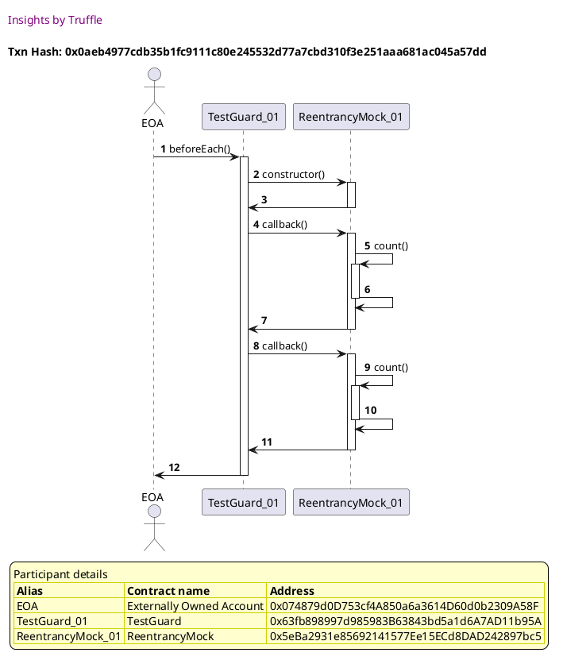
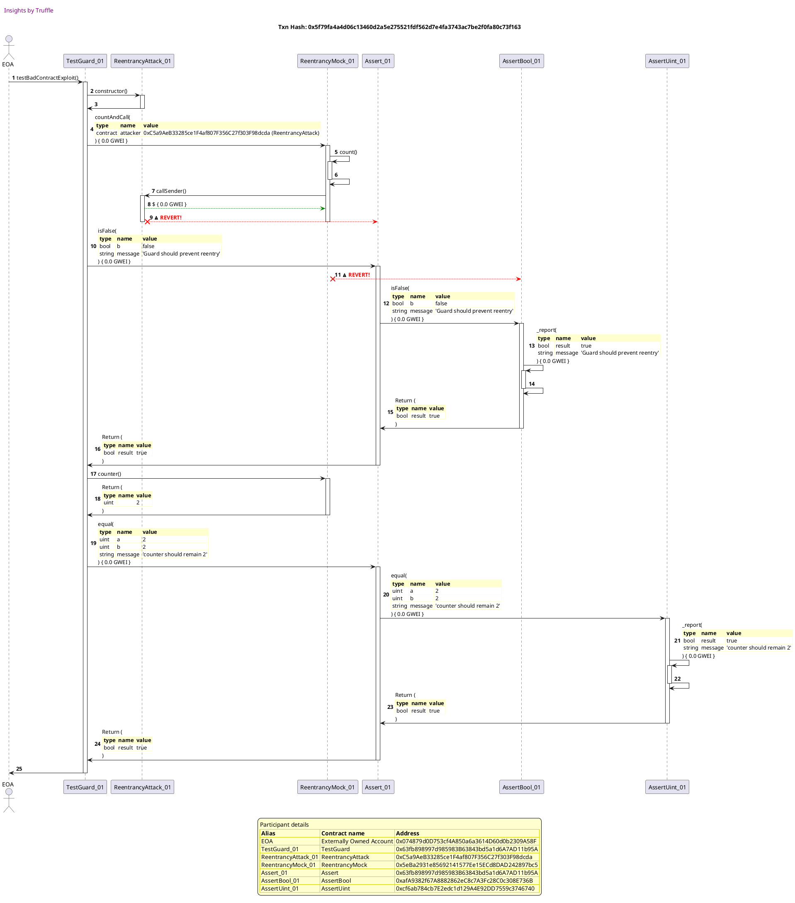

Test date: 2021 Mar 03

## Bad contract exploit
[link to test...](https://github.com/cds-blog-code-samples/Reentrant/blob/master/test/TestGuard.sol#L74)

##### d1, tx: 0x0aeb4977cdb35b1fc9111c80e245532d77a7cbd310f3e251aaa681ac045a57dd

[SVG :telescope:](https://www.planttext.com/api/plantuml/svg/xLHTRvim57tthx3QbqrTDHimjgikAWratSFKQklxTB5DWafCP8pMTDr_dqDOb3JRfBwF1uFlnxdt7jq3GbUT1-VxPOCGzBwr_R8q3dKFjLs1WoLkpDnOVGtgOUxQtkffsxGEdywAMJ4j4Bhi_Ben4uI7Ps506uT_Z5UCRrfNFxNMGvCrzTmkZVK1iVAxW5bmRY5NlLirvi3njNuoc2OxsnreNTivfcGq_HpUb-_79j1O_vFjwld2TxXSutlNLrN0HRxsZS7tZnRVGBUumEIHW2aJoRdIPSnAMYb9ALM2c2XXB8uqvy1LgMDAgjX4Z090AYWeaZ1WN6iKA5C-j5xSPXWwV1BU9oZGvcjLho2CUcyw_x47fxyHEaJi6mv3lvZ0ZGEhrfzRzV0x_iXwWj1G1fzFNg3XixCBN9ggTQO0jNZp5htmRpAEyOOqrThEktupp2Rl3r77vSxFB_1hIa3Jb66B_e7_r-Pwwr-Njktj_nXut9MD4ssLZExsbauR3tNJeSjHp-zESv8JGYRF7t0GRDZ0y35jD-MLnnQMPcF8j7Qc2xvTtkHvq40u7xrnDd2qnhVVhT4uKyFSmHNqnXF1fIOvPx6gaamm0Yd4AKtob6XIHZ6H6HEpG-033UrT1yWqhaeXXPHSIy6aYA_JM2HngHbGdMOyooaj9SiE8O-rzj8sW3Dp3P6CgH4ibH5DAEEyC9GLKotoB8-II4XUAXR00x4ZlUWgdE5t-Wi0)

##### d2, tx: 0x5f79fa4a4d06c13460d2a5e275521fdf562d7e4fa3743ac7be2f0fa80c73f163

[SVG :telescope:](https://www.planttext.com/api/plantuml/svg/vLTjRzis4FwkNy6bmvgaoqg9Ug42pwXiosq_32tIhFkm3WL5KevGMN8fAerRxx_l9CkEPSj9isJ5XWMEAPwEpzqzF9vvXl6iq4pfSfeQ1YjrdfNJI2gZ-91aCwRO5ALo8ZCnOFp3HELb9ePvcYlqQ1oEms5e6Br2prFPDr3zTo6Pa0fzQQO8lSXLyZdFD4k3D9baKvbfG8prMc4CBvUGirBDKjbwyIRvB95fhsMlcH19Da4cRaH_rcFlQUE4qTX_cHN9v48NA9gZSrN6CU0QEj6fHETN6Nh1YejJXA-SsFDZPZDRO9URn7Qni9WZBSznB3CMiUDQmfDsp8Xd4yQzI5enZXd5t2EnwH83AECQN0zV1OWLw0360mDeqmbFPWn2FPU5Vbuo9TvZizRO5BHLpoHmerZ6vu7MmFPgHOTyty9VygvbZRIzA2WAgVHAUJthKXhaUTfMR2HTohycsHPg8pamZ9eUTDBVOW4zUNAAD4W639AhSfhhy6gMvea-F3AsTAlLNOpK83pF2gtAQakgbPrwk-PFJaxHpMPM33P6oam7S0vOcXw-ozuPlUOi_DYC_SNFICzd4i6OiMazNhAqX8TAVL6vMGU95eZLZa76BY0TXmxp0paWnA8Eb-ROPZ75tfWuxj3oOeB9sAU22uOEjoCxMa8VeIy8_uJHyz_2bt0qkYAuBR0sRxSjMr9tg_xsDW5pRw2co1jswVT74mKl_jXZ-1HzlpVM3PWhm55Ir2ZNELwxtVlX4rCP59C-wl5bIGFD_l7nMVWsF3l_xlYuzxIMzmqXOREIIwRbdjFOhR0-TnsvjU5CnKXIZ5bQoB-NJX6SHiYV2FxZ2cKbXwDGrSe5cigYO1EGeyUr5wYuoCjKe9cIbrKzLhNByyTVdKIxjAugmbsfRUtABjg_dPljuBiZUA_aB5VwNX4eMPHfLJ6WldtxA9RdVA_UMkTCwb9bwA4ZFTh9azqA_i-PljilmtPHQvN41tQxX9zMy1O-rWtURjKQ-R5awRtiiMk3QrcqAUlAouQSLMOgEML9XgmRKt8hXDLDuhyMnjhlFQ5yq_hmq05ibeOElVzRQLXUSIjEZ6NZPBpUk2CBgLcI5XjUZF08Ornv0VqHN9hXONK7NliJ207cuTrwNNzHjnpmVGLxcS5zQevUVSgaG06lDxY-JsBFffulyCXp28_jW3gOkOoufZs2JWT75i5-uD1n6xZLicnCQqYNn17rgUzxmgUEJyd09TGcaN2OATp02qQc6VbEq8RiQcrsfNUx0-yni6g1jcKrk2C7pFA9AQdZ-fPfcuxdXT9qmg6Wes1asHRrlOWxRV3hLcdrV0ygsYtLvhm6PN7W4sh5hXTGIYtgMd98kHUGCRVe47E2QUWHTz05kcgzDkSrA8zT5ddKvf4NMb9mKvYM7zYXRuqWDHoVGtlhUZO6K4ZO9csDP_1TJjE_0000)

