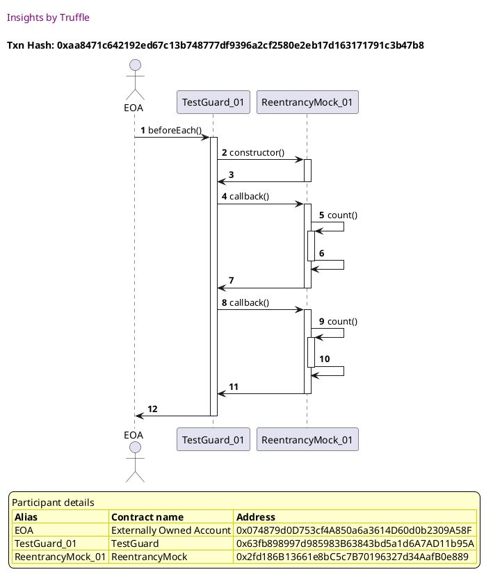
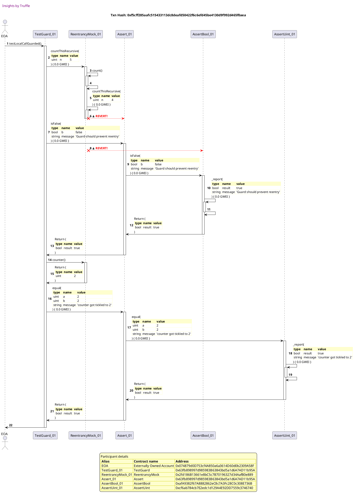

Test date: 2021 Mar 03

## Local call Guarded
[link to test...](https://github.com/cds-blog-code-samples/Reentrant/blob/master/test/TestGuard.sol#L38)

##### d1, tx: 0xaa8471c642192ed67c13b748777df9396a2cf2580e2eb17d163171791c3b47b8

[SVG :telescope:](https://www.planttext.com/api/plantuml/svg/xLJ9Rjim4BtpAuZaqY8DIeeIbo0r8czD3qM2DlU2csmXCcLG56gdwR-NabN3Zji2kLS7IfpbpSp3F05mqmJfGxkg091jg5sxKjQ3vh5qQ-db2bPsOPqPI_suy7NhpAIkQW_FvxFvR383uBe9sygE0EoVfPN6UlXZk49uM_logNP1LdbLBjpAkX0HYx0Fc4Vd3dBT-dLbZnnVooSBSRgttKjZIhU060scd_tx-ltG11ZgVt9DkLY61gejVF1jKKHS4CfGMVYmSV1MDiihY3PIyfHXJTC4YyGQoZGcYgMSCMOAGGILYIwIZ2ERM8MPmPHWXfd0cgYKAGuYPJh4rcTtEPGDF8llCn1f2wKkrpAE-c2RyB6Ltdn3k8yuD1o7Vh6H6o-TtdwkzUFl-1Fh6G1z6NWvUe46BowkeB95xUrCwkMRj-25lyiunUlJTEsQuDjkc2xl3r6dvIulh-1hIiYgKd6B_e7_r-PQ5rwNjklj_nXms9NE2NPA1lS7IsTia6NLWEj1p-_EfsYA41ezVu1Hi743uyUaxihh09rSsSwG6-Dj4ttxlD5phu5uReBrBdAqXNVVdJKmr_tSqOKsgDEMC6ZACgABDESPabGIYjCfHGQfX22HPtn-37oaeODh3qb9eRZWGZ0ZU2Ou6LF2Kw9C9h6XESkd62kHvSUGfrfxQUl1ay9WJiUOK8ejLvDCip53M52IC4FIN1PZP3aN4JmIEz0BRk8PVwU_0000)

##### d2, tx: 0xf5cff285aafc515433113dc8deafd50422f6c6efd45be4130d9f992d465f0aea

[SVG :telescope:](https://www.planttext.com/api/plantuml/svg/vLTjRzis4FxENy6bmDgaoqgzKu5dLBRbji265fwtVLY7WY8fHuWiUIILsgttttUIPSTlJL-I5HjcMA9uF3syvtWyyH1wgWrJffhc2B7Ab4KrJQH2-YehPaonASxbH1QYn_ZLH9LL8VfbNYhyO1WFutwCK4URHIwx23U_Iyc4LFXzsyNuUQcoTsLXM1xbsQIOoi80Oces2aCON47EAZNBvSx0pzaxYIrt8tl5XCYA2RP8A_ghQJjFMYDGE_-BGcUJIwDnii1ZLQKfu2AJcLpYyRp0pvc-lC1addeyJMtgCPPop_9Snx4iHt0g94k5HrpRJdtkorIuNY9Too4YJCFG5gxlfOH9Xi1bt83fySi8CurFe3r1u3QJyMp6WEfOQlEiOagy8LQZiItOLHr9y8rY1L_yLFAhjVw1TFUbI6kfp5fvqpkcr2lBV5UnbHnJ_YKhzb1RoGb23KjytjqZWny_li0693-MdELzbkVDa1IFJj6UPltk8R46W4E8cV5bfaUILqfdr_BHw-8rwhJnzbtRTfS_OBEOIGnjmQPDUyto2XvgzIMkm5oyn0LStafsYjzZyZt1ptwBNq3S73FWOtRLJ3xzjVFp2_n5qzmlVVUJwS_FVt-WfFYZjkycb1eUdM_VCbN0rklY3byb0D3idfsDub_ZqVYRixFEaqRUHR1vkCckcP57e_SZmqSYPSkKsaMP7h9SVw5V4WXvy4a2LrgZhENQg3glBF5KQiqc8CSF6okmlYohNE2PajTrxbADoOk7Tt3gUjjzhcDtrkGGxT_kcttonncyKN9MAdCd1ahgAg_3twZgwxDORViFwcrqHj9Kgi3tpVJq84xsTjG_ElNdvNcfRicezsnscn7XRzzYxLwkaNzMBB_JVEncmeqisPOTYylMENXI6WmVvgjS2cnARDyQatiSrj_h_noFZU4VuF9LCyIzCzZE3aVq_c_PONMKh7s2LdK6UhLr5XNIi2pNMrOCo80GKbi1vGGSJk6XNzRPWvkDFP4GC3sCRTxhBfiJEjpdi9W574qN-ENR0jOouiqAmn2Pay2bGIZ88F0SdheHzGZpcUDRxi0dWYIsGyB8eyDTu9qJ_bQtWVITDA4X3SD0XDGBgTFp7UewYV2O9VmeY0QMbOHUj0jvM0dionfmEnKMzNkMu_kMf4dVuq4l85ReEtOW73TYQOz8IiDTy9kAOVry1qjtAuljVWFAqYXqA1HHGKGfjQblopxbGUGCkKtxX3k4ne7Zzuw1hYkGxNu3obEV9G5rUHB4jXJS4fOTHcuSsWDOEI_aJk3wWKi05EAfZIhq5EvGu_uD)

