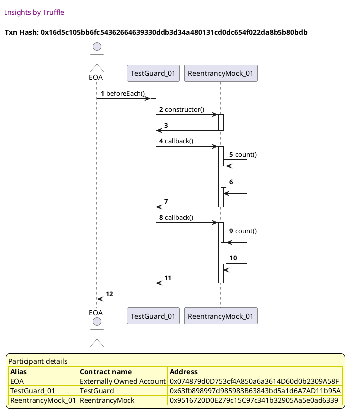
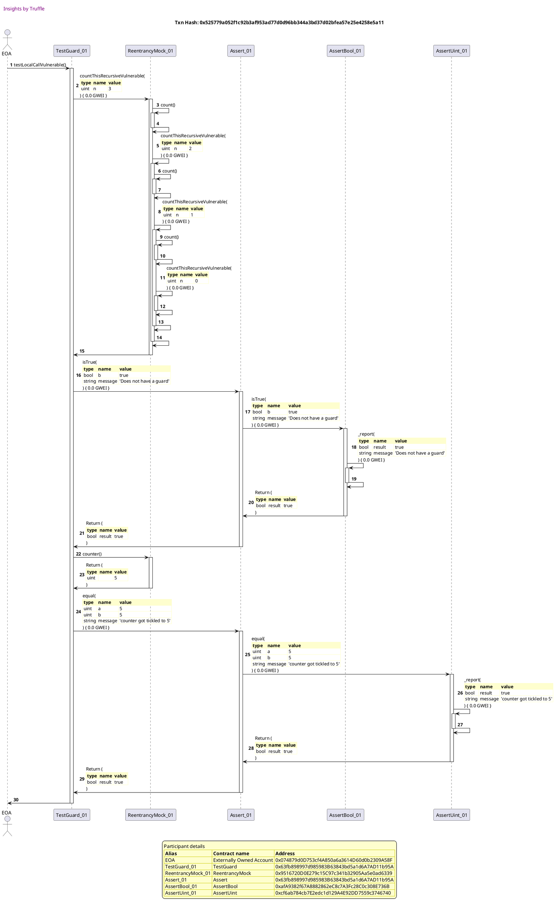

Test date: 2021 Mar 03

## Local call vulnerable
[link to test...](https://github.com/cds-blog-code-samples/Reentrant/blob/master/test/TestGuard.sol#L50)

##### d1, tx: 0x16d5c105bb6fc54362664639330ddb3d34a480131cd0dc654f022da8b5b80bdb

[SVG :telescope:](https://www.planttext.com/api/plantuml/svg/xLHBZzCm4BxxLrZT2sYfiEFOYQjIRROFbWFQ5VIE_4eRDNKgnn7jilntt3HKVG3Itid1YUUR-MRcqqm0kAkzSBvPbm28nbUsMKlZGBqgx4OuiOQbMHYhxuLQBLpLM3skoih1czbqDXrF0HZMVbUQ4O3jipH26mT_T5S87ofNF5VMYp8hYuLT6-i3O-wF3hC07YWtZTkKvWpuMZmRYEEZxKbeNTW5nAWp_MpVm_TT4Q3B_ydMnMBfQoXtSEwQF0-ym1U-D72-jV11rCi1H5lCD5KOKIbPhcXCMCHOp0Wd16ajYIQnY5E42LOQQSLedACeqYALLAP8QWc2PCg7qgUF6HGrx8Lt3mJPVA6AZGYjpatjFpR2wMy8jnwdXdFNBoPeuuHLky-LMltslxBs06ZJmFxeWWtUtWwWD7dbp5IevPktu0BVHrppjM6gihLtpRwPVTmVlAxJzVi3-9eKeYnbcA9_yF-rkCRwruKTQllV1kncPG-2moQ3fvEXqyQBegp1iDldTpSJD448ZLu-mB2mOGB3nxZQfrSUMh4sUqEcjJDrm8vnevTs1yAvzSRPeD4EFdwtHiDCjNq726rH4gS9rsYIKABoE4if4amGXkC9Gnh9Y22UqNHsJdosGoVNbfAHNAOyvJpHFAKy9VUCf36HcWgiMPPa4umbfzavvVMkNTfQSaunIw8Wo3HAkC9qp1D5OYn9n17D13L8Q4O83-H1s4vUS1VEy3lz1G00)

##### d2, tx: 0x525779a052f1c92b3af953ad77d0d96bb344a3bd37d02bfea57e25e4258e5a11

[SVG :telescope:](https://www.planttext.com/api/plantuml/svg/xLTjRzis4FwkNq5a7xgWoqQ9eYW6ML35Bss13IsoRFjIeA18oXOYKov5PN7h_VUTPTcMNz8jJLfiM0rR54-FZiyzF9zqdlUiSiAwUb9udgXTQUf9ggrNNUTcAgoOe4AFj54NGbwFR5aRrIkBqg9lXeFXe3VmlBFApGfzxg7cCzP2QOi-j5E4NfGsVryQ9ugao4Tceeq3ZvbR0uPmSUboMjjfeRSk_9A_ryWFrxRNGgdSZ92FMzEVpNZsGql2QzT_QQfyD7OLIcVeojPP1duzbxj2ewjRWrw8QdoAy2qDA6DSO1falkH1IaJ6AH6ACOKLZzAKXA4WgI8m3z9C2yfqG7KOq5XJuViUI2OTK1-yIf2eq16CHnx8vdAPJmM4UgKhzxmMLht5VeFe6hQXbngqiSB8sS-bl5xXzwpRDoLLfQrRWTUpGw2BiYosWQtb4FZNtEnuRIr7djT4YKxETu91Jv-U8WUMdqefYfueYj_gmcWhqa9_U-pjW1UtxyVM-92GPUvgd5UNMjQsoczqnz4RyyOxQvFlktOyd_-8t6og4On6J9hnHXGrd2pWSrG3TpH71dvaQJj67n3-7gFdlmzUGX8Tel9t31Sn_VFRJavEqISjyxc42BuAiHJ2_oh4KWZyK27k6z6ZudVAImFTBpcR2jdecLVmTFX4vLAedg1Q2ZzdD-RAsSKJQeuckgh42EpeIR_K5JAbGsDnev50emMd9uVbxZ3S45vLwdytwJNBEuY_jNfQMlSWvbPNTU6-EFrbFjs9MsCkjQkjGOyTul5UNkod--TR-dvFRcq_KWSVcNPRlU1BFy9svq-ltzMYUD1wOhFWsfPsROSIiXK7ZI0duMthkj0AkHBH-zI1rKlOVowEDV4xOlcYfU7H8-XMXmEu_rjrMFO72qsyPVFelUuq64exaHTLXqKVzp762nRG8qB70IUzSb4zf5lpIPI2vU7Q-hxpUTDsmV4MDjD0lp53h_umi9U9R7PuyKfpYraOCwvmdr4Yip29AHQH894VzYEiS1eGp1CQ3xSTRxLjdMdZCY9P6lEOSwPuJ7bCBY8IXz0cGakeeeGbVTzFEKssNUwtTxksnZcdViG246GGC2vzskDCaj1FIS0nJGJLMAY84BxjVDC6hiuVm7IxNUpE6wSYIpY9WonYIHp7GHm5kXTBbf2X3E8UbWJ70qQYYqDELsrbTzuubLaaKXQ7CcM3G2lfAp_WIJZWGHzsZd99M1Yn45vHFSYdDgkyPt2i9yLV)

