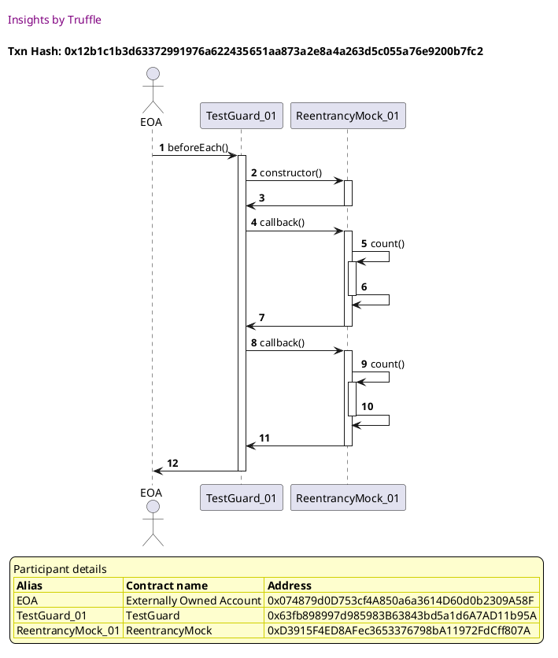
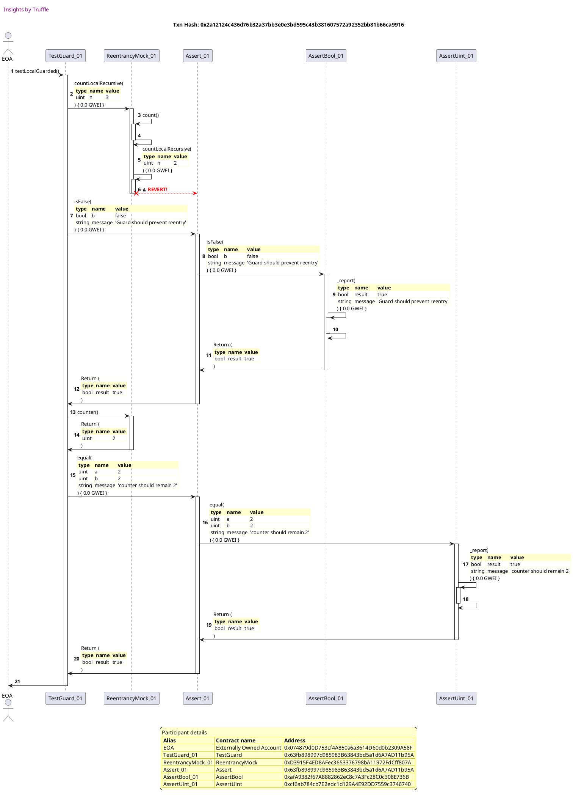

Test date: 2021 Mar 03

## Local Guarded
[link to test...](https://github.com/cds-blog-code-samples/Reentrant/blob/master/test/TestGuard.sol#L38)

##### d1, tx: 0x12b1c1b3d63372991976a622435651aa873a2e8a4a263d5c055a76e9200b7fc2

[SVG :telescope:](https://www.planttext.com/api/plantuml/svg/xLHBJzmm4BxxLrXmQKLHxJXsOaHNXCscz521MkxLn7Ps8xBEod7KNKh_UvsG8fPjAt5l3dOyZsyUccyGkkWyED-l6uIWzwtjrwLngBkhxGOSh75ZbiRgIr1tIzVsLi_RfdNuk5WKY_a2eVFExnepGtZyLWQqSVZ7zCJugdNrVMizD5bJB-tQM1yGA_zaK0Jb8-IcTvl6x2c-rlS6q_X9TWDQrtQ9APb4FyVx_FsK19hYVx9TlLpv3fSxVElwgWguoDU-CVXsQ_4LTAipJBOqAgcY9TE2iIIIaif4W8YYc771AK2QC8XC2Z54Wcck2EUG22CZGigaKX4ABLC-fBwupZ1q-2ZSHoYqpTUgta0ezTPq_cCFJdyZTBHuBjWt_M92RnnOjVlSghlVzWVI8uJ6CFXqzW8DdvoSuT9KhJCBKAitRz4B_U1nY3UwgTPstlL3COFV7wmEmvsUdk7NX82cASCK_GF_hydrrh_ExJ6t_sNWQLO69NfaChfvDdJQUAYR3frFV7vtd9ES439x-803OSC4XfzvEuHN7bjOcq6GQUrC5tHFVhE7aGFXt7hZREZH3bz_jqRZJ8rr1nNPaYHE4wb9dd2cgZXBEG41JD0u5qIJCc94PZmjze7tEFJiEK8ALfMfJALCj4ovJDcbO6dCIis1Qf4bMKvfANcs3td8jPUo4Jndal8YNkHfLXZ510zhGYGoBJCQLaLKw7bLfIGPm4DZf_QYYt26TVeB)

##### d2, tx: 0x2a12124c436d76b32a37bb3e0e3bd595c43b381607572a92352bb81b66ca9916

[SVG :telescope:](https://www.planttext.com/api/plantuml/svg/vLTHRzis47xdh-1IO6tIPQL4IQG2pwXYoss13Isyh7jOXu8YAKU8JBaKbTgjzzz7oR8ZEqwRDbc1OWOaaX-Fn--En_C9WAUbOTfKqnm0Lfb2LTD4Qb1UP6h6D9l2N4wa4gUCNqnqKIanAF92mmUZU1GFOW1wfLdaiWzWypkNJ4WDFxP329yNEljGACFoACycQYgLiHfJin4OsScLobcbPxdSclWz-o2XussmLqo8J4sWWrhedwRjFMb9W7R_5whC9kUcXCa2dkagJQrUO3AJItWsL_0vAyzF89gxp74Tr-CU3WG94kmoJ984IoHn8lpGjnC9faw0Y4zS5hhOTvE4EaaGS1Q6JW2ioxYnrEEN4MGbFB3j0R1kCndFPioQUYPBywnYMhn5JYFH1RP5nzBwHZF55xyL_68jVmtTNXILfTHcBRmPxHCwBOfyMx15zWd_aQaThIro041Z9JpkxnW37py-WSOYlnQSvGqinQD3i2DLhxjkLBEOs_1QhHvBNkaokvIFtgWteDS6sqzjsr_-0irY9g5j5PisxINBAzkfnPUmibpX4Yhxu1Ls23z2z3E2p_wCNzYWsSVWSyHgKsw_xFZu17xLDlTiltjh--V7VptGKlnT4xmAfCQGte_lcLRsulLXZw-klvNi7nsDuzVn-Eo7ewFUamRl0o7jZSWkcP5xO_SpqtjYfKEbzb5MZbXUVgLV4XlmrYU9VT9QonelZQwpoX9EPLcoYSNXmuO5BC-BAXTmfkLbdRbqGtdnSBzJkrxhxrwoxuJzXkuD5hpLSbPeSoSBj2ohl0vGewjlRyNgPjuejv4PIrDf1U_RqiDhSR8Jy__frb-MYwN-HDAxPzfjpkgah5ja0_ckOlcTzcDN6swmf8ljYylMEUl8r7BACWNTBqaBwx_JxysC3UyRJFcc-U6-3UYcXZro_xVKiAhpQf-0rKS0UDKf58KqBClB3eiX6YA4QXQsrhULe-qCYZfrSBFX4mbXjxTpctNzPLC-s_VSdgLYURw0BzyhAM34cmEsKsYEY4T9AD2G-9YdNaHzn0A60ySR1aYWnCKeZ7mwsbQyLNvtXetA0AS93MaO4X5IFwJuDC3Kgoj_veWW8j7GSPBGZxPLNY_JTx56-H27ZZ_ouY6DHfBZmCUO12IaIUGu8N57Of2c594TvLVb_Bf_1wRRPNztt2XbQHHYwgO1YIYbBWrSEQ2SH7Z4NJf072CQ4noSxbEw_ZpeZXkbF0rOGgZ74nAxKd17E6uOUN7e3kt9-I77n0k8XwnI6qzjL86dzcq_GFy5)

