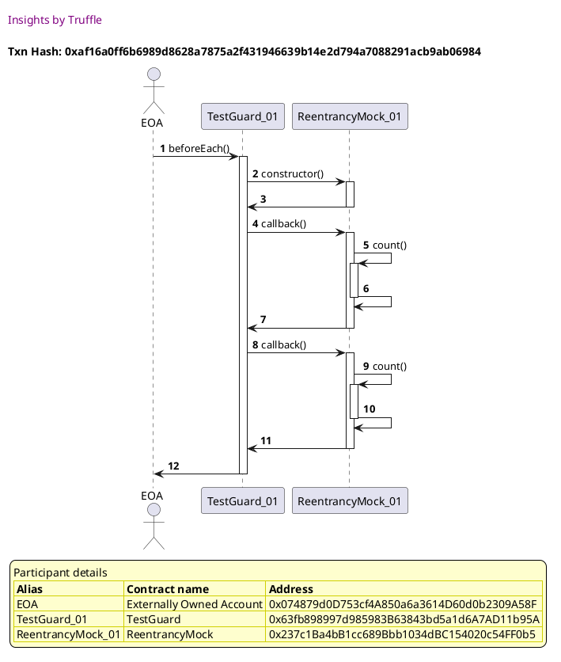
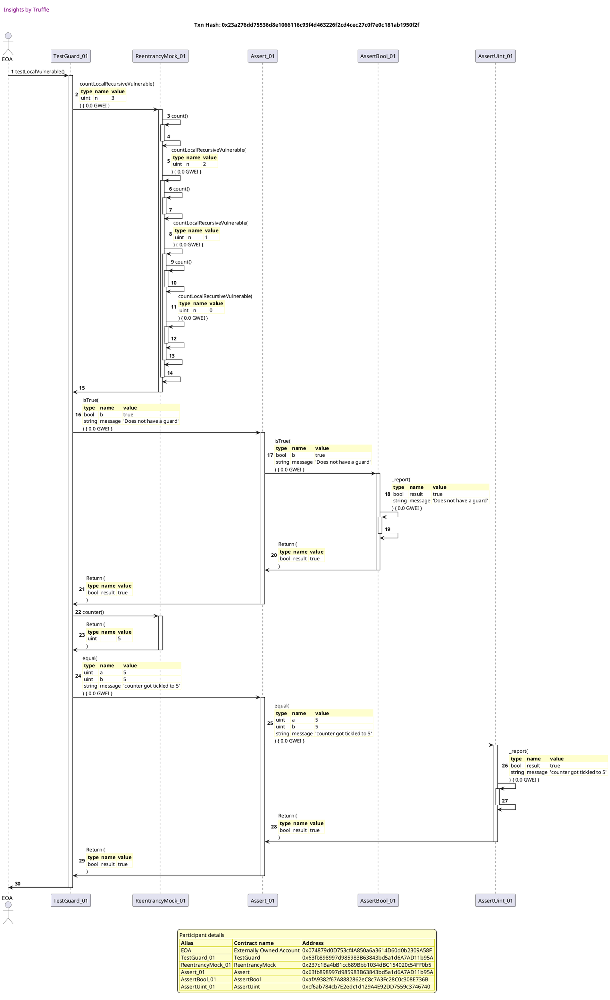

Test date: 2021 Mar 03

## Local Vulnerable

[link to test...](https://github.com/cds-blog-code-samples/Reentrant/blob/master/test/TestGuard.sol#L26)

##### d1, tx: 0xaf16a0ff6b6989d8628a7875a2f431946639b14e2d794a7088291acb9ab06984

[SVG :telescope:](https://www.planttext.com/api/plantuml/svg/xLJ9Rjim4BtpAuZaqY8DIaeKHGQf4NbhUYWIjBaNmqMs49aoA0grq_JVIojgOCTjWToh0oNEycRcOPuGkce3-D2jQeIW2uthLifwrDvNRWqULhYs2-lC6FJzmZUTCvEcRZm-dS_ciyaCeSisR6ixGhX_bXQCzVZ7SCNukl7LG-C2r4LTBTpAkX0Ho_0SC8_E9yXrvzUrFN1yhHuifkpPTWl6L6w1AHbCF_ltvVkX2JJK_-JQQh4CBLPRVEUxieouA5IXjlXku_0rjCiBJ3PGKWwaBBdYKaWZU28W5ta6ISbIAXddgLIKsSJaaa5EX4Wa1QqaA18p68gKwH1RdzqK65fy4jydAD8MAbsj8OvwPzlmiGDllX7QH-mR3aE_sCYD1wUtdnjz_pl-o7g2K5y6duzUeE6pimkiRDbuEmEzVFCMlV3lCexn-ZJTk3RuRZVCBkyFKSVbpiyly6jAG5shk4N_mFzhSvqBhqjxwkt_67ZObPqJFIaPtUujdR41ghf5buEUtvrEoPGGCdhyWADWumR6ZqcpAwy3Th2oEqDXZBTjz3tdZHvx3SHp4wntaQCjlldkhC65xkUEBh8XEHEvD6IQPwakMI4o0XnIJjcK4qDKaX9PP69-27oWeRrh3ydJKeaeNfaRAJ8fqZ5F1KkLoO0QNkJ5b58bi-8GybXhBsqzU9Bccew1gJ7LcWivLegIb9dnX6QC94HdR3udAelWaTY1NdGLp_Wx_GK0)

##### d2, tx: 0x23a276dd75536d8e1066116c93f4d463226f2cd4cec27c0f7e0c181ab1950f2f

[SVG :telescope:](https://www.planttext.com/api/plantuml/svg/xLTTRzis57tdho2oXoxeif6YH5515bJ-QWjiQ95bsqk1WY8fHmXDkHILnQtttqVBiYr_f5kQjDYm6hOeNXrUddjqVQKBmBFASUlgYGQ0rwuqzIHJ5bJNXPboooTGgx4oiiV5zTYMjP7zKfSMVZCQZeRz8G1dbPjfTGvWyxbIN2eBFxHJ25-KjdXV6iTrgekncIZZlCVShG4ZVt7fSbhRgLPR5tuftYk8mxNjDPUoC6E8KMlwindFVcX9W7R_bwOgnbUkWjaCNjewpxrVu0gd5RoyDV05hwvE8ReD20zYAcKSHOHAfZ2Y56Cg4fA7CgGa26WU21aA9O9Oe3nMI626UOQJ2EL13hnamddgmrSfv1KyykCHyBAvGXHJxaEzL9LxNdChtoBS8Bg6RUY5yjfORiJivr9Sh_1xrkr5QLKfwrRWzUmGg5UMUXlOMWw1VotCZjVMSWH04oKyETy91ZvzUWgTj_nK2gv_gxLHbcTQVNiCTe2BfVjnDUk5px2bWmibQbiLDwhZwOrv0yxQpFkk7S_dFq8tcoheHyCdpNZ3TUrF5l0vh3rnE8V6_yZITWm_GFGzWiz_7xxq6NI8ozzHN0JrpvUTd9p2JzhcioaHV5MYLG9_LQ9L0ZrKYVk6zAZudHBJGFVBpgP2De8MbNywVA9ocQ-UNhNC_vpTc2jd5q-eEPoegk9ZRuTF1gMge2aTlE8t2d8uNd1wSbZk3iCDuLMb_dUJNhEyW_XRgwQbTGzYRbLLQ_V5wI_pwKxS6dEXN6qDVEmGZ_VoOZ_TFz_MztjwA_kHGlZ8jDlgvR_HHzZk_EdLkvhh1-t7DnkkRLdNTYWXMt7WsEUaVzkwraf2LyBeFdLWzHBsdujZJVoEMBveQNZq2BhLuG3k_rOTblt1GXEmR1x1wqw38PNZXQuwB0PeW11QiF0zekyu_4c_N5GFuTPyKYdzzlxQUjtvl6cx_F7Mtqp3jPx1LtyOVozJqTpXnIlDBOf35YSI3UA8Y3nCMOGuvOJYS42HH5b0K996RBJjUAjjwqmRbvJa6KjOaiGoOL72I8yI5f9CHXnBciRf0ECiYT9jb_ljtQwjSHwGME0U3xCU5eAof9Tb695Gzleu2b60H1IEHYYBjfrlsi3L-GEORhUBtNdZbETfGbYGqpXbZ0MC1ghFH9oIaGXO7mc2s30cj7V8wQgjxCuRfoAdF8jPAB9u62WfiCH1aeR391ZuEnSbWiGXZKF_YWfyFhLP1PxvOptHVm40)

