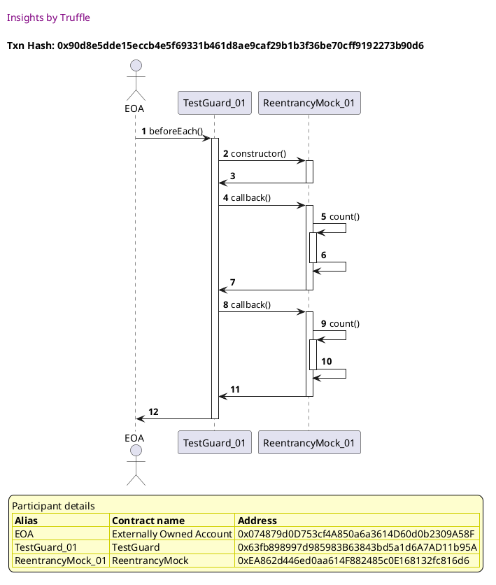
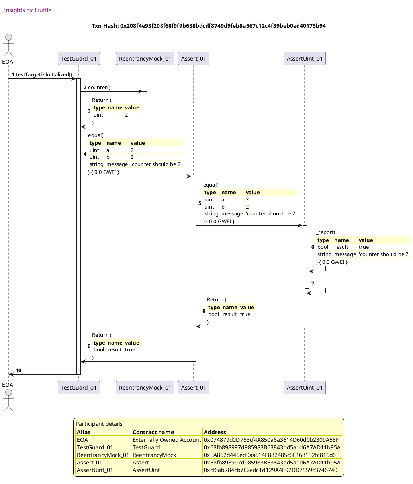

Test date: 2021 Mar 03

## Target is initialized
[link to test...](https://github.com/cds-blog-code-samples/Reentrant/blob/master/test/TestGuard.sol#L22)

##### d1, tx: 0x90d8e5dde15eccb4e5f69331b461d8ae9caf29b1b3f36be70cff9192273b90d6

[SVG :telescope:](https://www.planttext.com/api/plantuml/svg/xLHDRzim3BthLmZjPKDNJB9iMIgwe6xZh3iCBRRU1ttGYL573cGPIxhklqznlI9fjW6zpmVP8laUoGVI25rqGVdGBnk4L1zQroyrUDJTrswbl5hY1kRWxAKoztFVzivUjKthyV6id9LN9KBdNTWqC45uU1QWB7ZyOxnYVDtw-g5rGJL5Ky_T4bo8Z5Lu3fX5vnFbglUh1lOSN-i7m3HzjjqgQsitnvICff_3-_pzM0GQytzoNJrVX0xh3RxpVLL5NXJgq02-MpjyhRh56IPhIQo0p5gW6HYZKyWgBXcZEkNK2WNIg2gHccfMCQuX9wQg99L9aZCTiHn5oKo8fPSt1LOTFehl8nHb2xMfLogsUWTT-DWhRxyHEaJi6lP3lq3KnYjdDfzRS_yx_i1wXD2G1fzENh3XavCphA5gFPJABDwyHI_yMyGXtm0phUk2xxVDR75_Y3fCTtfwXb-JGZMDZbFq3_w_5jUxy3hOKst_sy3Zh6oTw6cJqUtEq5a8gcuwT3xkyxlZAPaIGYQF7t1Ss3Y1yUEgtQOt0JkrXAsXiDP35ttFkCdZi0FnN0VmBcgqmJVV7LXScA7lw29hagSYbvPCyuoPAYr4HXHNZDDqoeabEc545fcOxHFlxT3ETQ3ahD922YbpAqKc1RlaJAHCsqnHoukyc5AgPLRiKnxksalRG5uMWYSsJJbOebGiSoP4aehCa99oGLbI6K6vvP4y2ZlAYoxY6N-dlm00)

##### d2, tx: 0x208f4e93f208f68f9f9b638bdcdf8749d9feb8a567c12c4f39beb0ed40173b94

[SVG :telescope:](https://www.planttext.com/api/plantuml/svg/rLRTRzGu47_tNs7r7W11mKcSnAvAHUXceG-ewAwdUq52_iesQjPPR0UwTFdVcQJfVdGB3mVtSAjLRC-CV_ERyMGSX5xv85pevWr2eWkjxURIEEIlQhiGJinnOsR6wjT2NSrSsrbzsZQjmtzCosbvMY9qxCEoCIS83xzB8xHn-6PSOlosTVNNrWRH54qzitDZ0o1MOMqm1UKjvA9pYyRiAFwglneSqRNilT2wjZCSaL7qRHYFNumaqEZ_pFfwTXaybajyuRgg0bmKwj0OV75jyLlXBuymkOu9gwZXITLFCbRnYiiiOL8hNR6SSiqh8vb8irn5iQ9LmgMHn6XAeZoHd298cGf0lJmliF3u0CO316aBjQeN0aAzC3wywOJJ7qaqM6mBTat_D90R9wnQlclLrPtzddHtK-6zSU7EUBrwoEZlsjup72K720t4yU79FNxuwTCZ741o8TpCX3D_PkjGYmPEHJz-WkuPzzltwGuO2Wed6DVlUS1Yt-_XuH7a8tJEuiSVx0TqF9RRit4yMRt4ORam64OhviFuMJGTJ7hp5UuWDBp2y8zlHG-otUHhO6a-TQBv9NzYut0jazio7rnVloiyDzwB6Up7ZyRaO7_PTet6qk3uqKWQts3odE0t_vHdKEhRV3Vqxqxn_nJ2clCFmlZepA9ruTy58jks0LBE-AxfsGUtqVtNvFl2_OdTxodk7mVuPAz6VlDxzLFN-o_ORLlfSu9khn7qVgilQHD4tVWj5XCo8OJqBE2sW4O5azEsRnSghFaKMeDxqAttdQo61WpFQpX7AvfcYS-_MADneOR31HMv9ZbbETTaagU9gcZ1KY8oaMGHdMH44nadX1Sfc-u2xpJmhUK0cIMLP9nndclEKiwIrt1xq4JgL4GwA_9Y4aMIfyKkv7wZloyRmCk2PR6cD3EQ204qfup5bAMAb576eYIk58iodUs2Row4k_alCDszEBRN0wYgCY5pHfNCozXe5UaevWKjUJo19ATS9JdDSae058v-B03q2fxmjV4T)

