Test date: 2021 Feb 17

## testTargetIsInitialized
[link to test...](http://github.com/cds-blog-code-samples/Reentrant/blob/21b80288141661bd6f89ab0fe6b2cbf29789200d/test/TestGuard.sol#L22)

##### d1, tx: 0x90ccb8143ca04cb720be5a71dde8f3d1fe479a3993a497ff3afb875d3e3c09b4

[SVG :telescope:](https://www.planttext.com/api/plantuml/svg/xLNVRvim47xtNs6rBvkwQ3OsFnnbKHCWwnwcLblV9sER18MOo1WrQRl_VOQmA3JTfAclum7mtNVVTpxE1m3NjUN6DfiI0DxOIZURJ1bGhmkzvOPlOAcMIiiv5-kbgHejuwgi3BnSf8iqJW6Or7PVgYc0tRLIN2e3d_ebX3ULAHuhRNavAukbtYXj7MDkZu25SnuejutPbchW-5uyAeZfqNR7fIpq4cBKctvspyd7FWdGwt_HTR5SsHfcUtXlcZntlC0MjbJmVgVX3QzNOuXs30cHHPWImH4LMUYXJFayn5AgA2SIvug6Z1F62ASip7F2yomAVKaK4OXb5BYI2UjIJszdaDVmmZqlW2kRBKInvMwhzwgsdnjkv0-4EyIfOGXrfLLveTKHUceOGhyfLqR3jTX_hSJwD_xCUW50bn4SJLy8mwkhCSnKNXcLSh5wznwyyBSH0_qkej5hNJteKQ6jCfgN8yqtgWqUGi_bHgCnV4tYFELEHrIwjgPfIzkolu9wkmGloyprz5_u_vXSe-s_XHro-xyDsBTZwmI7kGBkJlfQAikBiWQJVhfyk4nGWX2QFd-2Rdou9dSlSTNA2mlRvciDCocDgftl63Tzxawak-yEZLhkuUs3Qqyu4zs-dGljKkgBEOzP9EUIq2nbFbummJoUKeHn6XB28iKNyo7nu4IVB3jAjf0Onu4N4qeI5Z17cj5048PHGd8MkZapetxCXfI3at-oV0Fb-OHuQJkGnoH2GIWy6OG1ynClyBCib2nC8Xfur9Suy70YsXAuRzL_CN3jxkv_yGi0)

##### d2, tx: 0x0e4a288f7fb1e78177a40470fe55b9f8708b258b4d9e4e4c8cfa874c179fa720

[SVG :telescope:](https://www.planttext.com/api/plantuml/svg/hLPBRziu4BxpLmpIGrgqsQNUKf0DQajocqEHeasnbm85HLAE49doajHktBZ_lIDPyJFrOHl3u933uSmt3mv5o5jZcRRjh2Q4jRPHxQoGcfYxIisPPZEevLGgCMRyRggRLecqgHiDBoRv94zpGYwCNTJoaa3_kvLCI0qFmnBWVQEhxusoh1xLrLJDfBAeiRHhWGbkhbJEMpslvSx6v-gx1CTVypuo8Ier1OSEh1yzlVXp0446-rVALDDRQw1Om8rkonBr4blPMiBDlOBtpDoU0xsdqcTk79THMJWoYfqeOZxr8rhA82YICeveNBX1NFWYaRxqUSnB5aS-TwAaP95B2OQCMuIUNu-06JX1Ua8mRBRYrPoXgpVIs7Sjq-8RTNg9RSQkw2U9iT5CySM7XjyzoXzmTm-DZ97QFWglLqy9VQdKdk30EI6a1mvdbtluuFNhSx38kM5wAksLkLALhLYDMH4lNv4zuUxu8TnU1yV2iL9tPvwGEBHxTdQEyR2jLl3og_fABePoUpFGo-LVO1Tp2KWLc_NqNrQtEEd4bz2YQx04_BihrfDeD_7gKSf_MbR_bZssCRZc5TiyOtLNlqkOIMFO5C_3wH0SCBTDMmie9BYd0sXu0Fe7XNT_vrTOwjjuD_0Vi_YCBgHCdLhGU9SGC5vyA7KpWtbZCFkDWZC7RDEDXuxIOuuUzMhjnYyy-wRblD7s__bMD4sD2BGqRTr1jNgpznmfEGQ-g-KZSizJxxzsyDL1sJppLJjg-l3EhJfD5nEoUbd8nwrM9QHbLMssK6GqevHsAF01mTw5axJfEWYtQpmZ8T0yxgtFNIxxdepZFUPHiRfUmFL_IWeOyJwvNQtUvtx0nonDOZ4Mdb_aIU1C4fwuBFUfu-IHvoMnP9FnhkATdhwrx5Kc4-4uQUYcdkzbIPYWqi8FkPSuDFFA9EACZlmWJNPL7lR-VTvAUUh5D8ouAy8eJ8BC3OEYY4GIPR4VkduWdD1rChw7T_D6FCv_0-dkMxAzxfK64w_aPHO6GUHbqYiAwZ0tY-bOf34-c2mi17F22Di4mTGF1K3UueWV83y1)

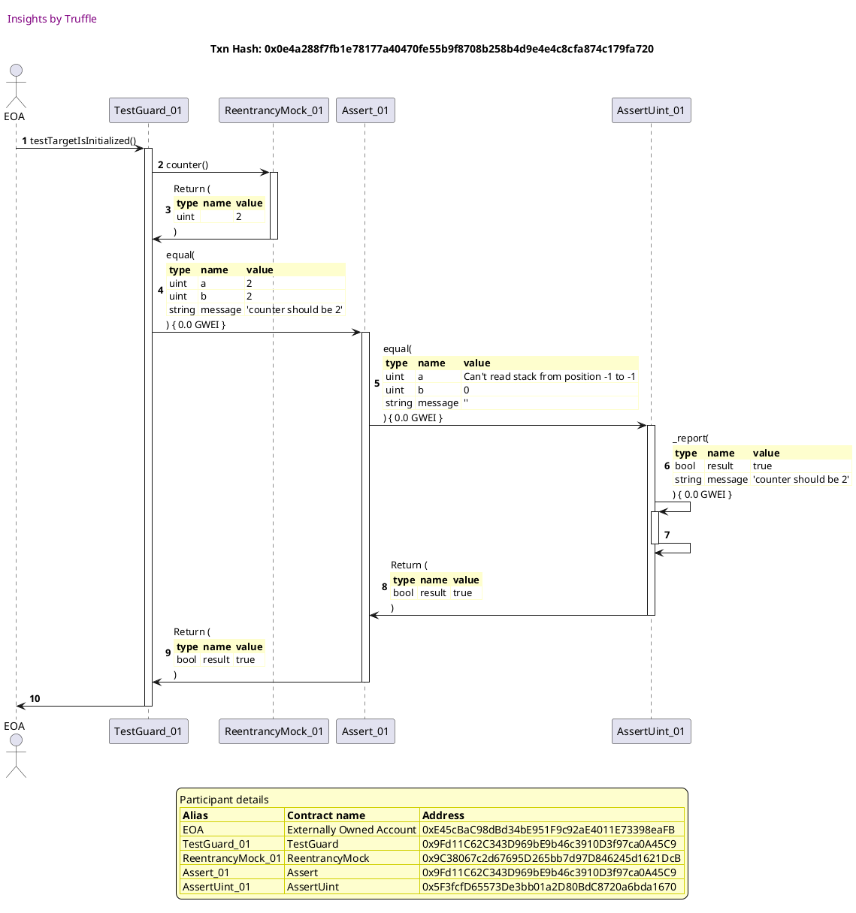

## testLocalVulnerable
[link to test...](http://github.com/cds-blog-code-samples/Reentrant/blob/21b80288141661bd6f89ab0fe6b2cbf29789200d/test/TestGuard.sol#L26)

##### d1, tx: 0x0cde2da7108902a57d9002c4868488a954a0077f55aa825dd9b2baed24caca59

[SVG :telescope:](https://www.planttext.com/api/plantuml/svg/xLLHRvim47xthx3QbqrTD0Dsm5KNbH2oxc5gjVLzEcoJe10J6QCcRVVVPmYBGjDDclew7W3VVVTzv-Dy87HTMp2sMPS8GMChtQmpPL2zAlG63AnngHPAooc8rS9KZPP9LLO6dy_JUPga25tLTbUg2SBTjLGWbS5F_HBZcyeKZvMsKCPbiT1hfQrZpEq1C7VEFUMcCPjI3HpVYqU5FNgmtO6KXLvWZ_IcdztpwcEV1Ehrl-YwM2njZRCTlZTDdZjUP0jRAdo_rVW6wkKb9biYfF8bX1w9EF61XP8JuWiQZICQHS0P1KB2C6SC8FAPb3ppCr3Ifm84C8vSoOHrgQUtCOOQdxdd6N9biuKeDk2sUgzg-xa18tyGhqCS6uPGLrgL5reTeCU68VIRScKqeCNkQoLMl_4drZE4kepmQF9265zSNE9CvPLHAOZbk_VeXR-D6EXt4OrUwUf1ZmfjbT5GZZIiLHiyX9xAZKQN-3M9qvGx7L7fsfgcBMtB_WhgxH9GbfdhwR_m_p6vHjj_2zldzdyRk6_7redsSmNT7VMrL1QAiaPN_NJvS3uZCqB8vFaJTkF3DRbxIQfMNbZSDbzhYAKqgdQ-GzpakJkHxhxTDsgvmxSFhZrnBBfzEnVPffI9AIGyabCPq2pbp9jpmNr8AV6yD0m27YcOJuV4WnDzjEme-LnwNZBsau06CpxcZZIZOn5mZyo2d8S2I4nPmeUKWvD_j7m3vUc4U6dho5aGIYyEPzwCZIEVnc8cFPenAhCn2ttf9Y5dFibzH-w-LV_5qBMxk__5Bm00)

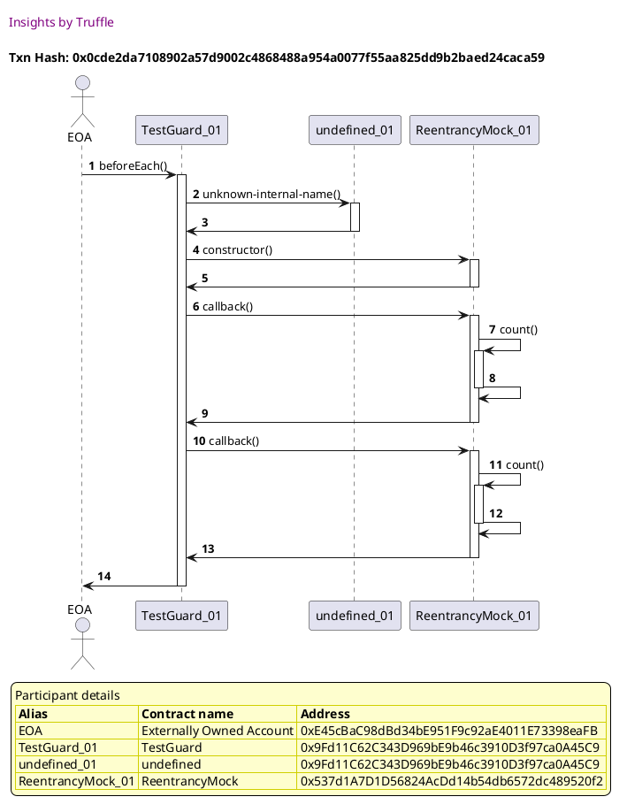

##### d2, tx: 0xf280314e30471509cdc392a3d810844b583a06e74b165d9d2650b963599bb042

[SVG :telescope:](https://www.planttext.com/api/plantuml/svg/xLXRRzis57xNho2oXopel94ITGkoeBObjmKsjCYoxQL0GP6K8uIcN9BAujRxxwDasP4lyPRRC60sODCy-dZudOz7b7WSvxKsH9bg8Xo7LAQKrIJZoj7NXPmIHIP0y36NR43ezLYLbMJ3KfGAV3DAH-amTPmpRMQ2dpkW-LnnmhW2Nzik06zBLNmffI6YBugnd71fhCVSh00ZUt7XSbgfgU1h5tufld20yChsWJ1Mo350i3NzsRHdFxGad7R-Tr8NuokZGJO3bwhAS-lNCOKH75pUIl2MwAjJ06zpDu8Umjo3E4G-Z2cZNkmIZqK8HXXdVkGH6F0GPoZmMSpSm8TP77X-76SPnAvZ9QF6Ka_Vzm7HuCYsHuwLpHIqc18RwYNNvar55Fi4KOFe6jQX5zngeuYaivzBUht4RrdN1_MrvieimQlUBj2WBCKwiBNi0lzQo0slhUN8SPeeGUzy8nZmwjKfCDRoKqc9-AqIaYkI2VxjYRC1h8TknzMCfpR35WukEAsKBcvunzD7-T4vQpFlkxOzd_y8p6pAWMqbcJJj3H6L_LF3vw2onC4SIFj5S64y0Ly1_1w2Dx-dxsmAxIBpTnphgFxvi5xl53ngcXUJ8ZueqIeH7PHebGWFIhHA10SbMYNyWnAj4lYWHAk4Tr2YLS8zAB5yjJeeqIhnv7VCXuPqmF-7yHiddmQwVHgwExWr2LfeUsXzP2Pczb1dip2pNwFkpDge-k0y1nEkDHbREpXEIgw1B0su8ZSS432kEHtlJjyEmpl2omFaSvBEYT1xMUybk69q3ybFYazBPPx4Kd5T2VCY-kwZlyYTUt4hp0KtbPBWkKCysSg1xTH-kQaVLa3WQiz3v9bfjpj__GXqzz3TkCFvvug89qr8EZEkZDcQSLTEjlg0iKrBKz1hmHamfHtqaFj-MGjwnb26H1uRk_Y4MTg4NeDSbHCmBNLXYbA27gfPzj2EUE6ZDujL6FT4zgzk5ezRc7qXT3UC7RZ_suQng5hMcZYBahRpeLFsPDoGGkWEYmGc4CAQHLyKHDVJ3yjwGw5cnQVFc9tUNbkDEvytnM3xUsjNKn8XPk3z7z8kPfysIrndx6sAVJeWmpXY0-RXB8rzD8ffx98KGuJIqFFYY9FHODtnMZ6vqsrSnYE6q31mXnxsaZY8hTCC1zIB4KoyF0ufWNti3-Drbzj5vqrRuzptGeRwOO8IFuXStAS9GpZpCSi2FtGPnL7ikp1trvtV5QUN_v_0TBs8tUqtJiF47GGXStFcSs-KXaCSGPTY7WKuH106LcAEWtGdmsMnkzjVX3toSfedWU-7NiAzB8E8k4a41smOXIuaGSO82aAx0pasdzgiSbxRtseY_W80)

```plantuml


@startuml

autonumber
skinparam legendBackgroundColor #FEFECE

<style>
      header {
        HorizontalAlignment left
        FontColor purple
        FontSize 14
        Padding 10
      }
    </style>

header Insights by Truffle

title Txn Hash: 0xf280314e30471509cdc392a3d810844b583a06e74b165d9d2650b963599bb042


actor EOA as "EOA"
participant TestGuard_01 as "TestGuard_01"
participant ReentrancyMock_01 as "ReentrancyMock_01"
participant Assert_01 as "Assert_01"
participant AssertBool_01 as "AssertBool_01"
participant AssertUint_01 as "AssertUint_01"

"EOA" -> "TestGuard_01" ++: testLocalVulnerable()
"TestGuard_01" -> "ReentrancyMock_01" ++: countLocalRecursiveVulnerable(\n\
<#FEFECE,#FEFECE>|= type |= name |= value |\n\
| uint | n | 10 |\n\
) { 0.0 GWEI }
"ReentrancyMock_01" -> "ReentrancyMock_01" ++: count()
"ReentrancyMock_01" -> "ReentrancyMock_01" --: 
"ReentrancyMock_01" -> "ReentrancyMock_01" ++: countLocalRecursiveVulnerable(\n\
<#FEFECE,#FEFECE>|= type |= name |= value |\n\
| uint | n | 9 |\n\
) { 0.0 GWEI }
"ReentrancyMock_01" -> "ReentrancyMock_01" ++: count()
"ReentrancyMock_01" -> "ReentrancyMock_01" --: 
"ReentrancyMock_01" -> "ReentrancyMock_01" ++: countLocalRecursiveVulnerable(\n\
<#FEFECE,#FEFECE>|= type |= name |= value |\n\
| uint | n | 8 |\n\
) { 0.0 GWEI }
"ReentrancyMock_01" -> "ReentrancyMock_01" ++: count()
"ReentrancyMock_01" -> "ReentrancyMock_01" --: 
"ReentrancyMock_01" -> "ReentrancyMock_01" ++: countLocalRecursiveVulnerable(\n\
<#FEFECE,#FEFECE>|= type |= name |= value |\n\
| uint | n | 7 |\n\
) { 0.0 GWEI }
"ReentrancyMock_01" -> "ReentrancyMock_01" ++: count()
"ReentrancyMock_01" -> "ReentrancyMock_01" --: 
"ReentrancyMock_01" -> "ReentrancyMock_01" ++: countLocalRecursiveVulnerable(\n\
<#FEFECE,#FEFECE>|= type |= name |= value |\n\
| uint | n | 6 |\n\
) { 0.0 GWEI }
"ReentrancyMock_01" -> "ReentrancyMock_01" ++: count()
"ReentrancyMock_01" -> "ReentrancyMock_01" --: 
"ReentrancyMock_01" -> "ReentrancyMock_01" ++: countLocalRecursiveVulnerable(\n\
<#FEFECE,#FEFECE>|= type |= name |= value |\n\
| uint | n | 5 |\n\
) { 0.0 GWEI }
"ReentrancyMock_01" -> "ReentrancyMock_01" ++: count()
"ReentrancyMock_01" -> "ReentrancyMock_01" --: 
"ReentrancyMock_01" -> "ReentrancyMock_01" ++: countLocalRecursiveVulnerable(\n\
<#FEFECE,#FEFECE>|= type |= name |= value |\n\
| uint | n | 4 |\n\
) { 0.0 GWEI }
"ReentrancyMock_01" -> "ReentrancyMock_01" ++: count()
"ReentrancyMock_01" -> "ReentrancyMock_01" --: 
"ReentrancyMock_01" -> "ReentrancyMock_01" ++: countLocalRecursiveVulnerable(\n\
<#FEFECE,#FEFECE>|= type |= name |= value |\n\
| uint | n | 3 |\n\
) { 0.0 GWEI }
"ReentrancyMock_01" -> "ReentrancyMock_01" ++: count()
"ReentrancyMock_01" -> "ReentrancyMock_01" --: 
"ReentrancyMock_01" -> "ReentrancyMock_01" ++: countLocalRecursiveVulnerable(\n\
<#FEFECE,#FEFECE>|= type |= name |= value |\n\
| uint | n | 2 |\n\
) { 0.0 GWEI }
"ReentrancyMock_01" -> "ReentrancyMock_01" ++: count()
"ReentrancyMock_01" -> "ReentrancyMock_01" --: 
"ReentrancyMock_01" -> "ReentrancyMock_01" ++: countLocalRecursiveVulnerable(\n\
<#FEFECE,#FEFECE>|= type |= name |= value |\n\
| uint | n | 1 |\n\
) { 0.0 GWEI }
"ReentrancyMock_01" -> "ReentrancyMock_01" ++: count()
"ReentrancyMock_01" -> "ReentrancyMock_01" --: 
"ReentrancyMock_01" -> "ReentrancyMock_01" ++: countLocalRecursiveVulnerable(\n\
<#FEFECE,#FEFECE>|= type |= name |= value |\n\
| uint | n | 0 |\n\
) { 0.0 GWEI }
"ReentrancyMock_01" -> "ReentrancyMock_01" --: 
"ReentrancyMock_01" -> "ReentrancyMock_01" --: 
"ReentrancyMock_01" -> "ReentrancyMock_01" --: 
"ReentrancyMock_01" -> "ReentrancyMock_01" --: 
"ReentrancyMock_01" -> "ReentrancyMock_01" --: 
"ReentrancyMock_01" -> "ReentrancyMock_01" --: 
"ReentrancyMock_01" -> "ReentrancyMock_01" --: 
"ReentrancyMock_01" -> "ReentrancyMock_01" --: 
"ReentrancyMock_01" -> "ReentrancyMock_01" --: 
"ReentrancyMock_01" -> "ReentrancyMock_01" --: 
"ReentrancyMock_01" -> "TestGuard_01" --: 
"TestGuard_01" -> "Assert_01" ++: isTrue(\n\
<#FEFECE,#FEFECE>|= type |= name |= value |\n\
| bool | b | true |\n\
| string | message | 'Does not have a guard' |\n\
) { 0.0 GWEI }
"Assert_01" -> "AssertBool_01" ++: isTrue(\n\
<#FEFECE,#FEFECE>|= type |= name |= value |\n\
| bool | b | false |\n\
| string | message | '' |\n\
) { 0.0 GWEI }
"AssertBool_01" -> "AssertBool_01" ++: _report(\n\
<#FEFECE,#FEFECE>|= type |= name |= value |\n\
| bool | result | true |\n\
| string | message | 'Does not have a guard' |\n\
) { 0.0 GWEI }
"AssertBool_01" -> "AssertBool_01" --: 
"AssertBool_01" -> "Assert_01" --: Return (\n\
<#FEFECE,#FEFECE>|= type |= name |= value |\n\
| bool | result | true |\n\
)
"Assert_01" -> "TestGuard_01" --: Return (\n\
<#FEFECE,#FEFECE>|= type |= name |= value |\n\
| bool | result | true |\n\
)
"TestGuard_01" -> "ReentrancyMock_01" ++: counter()
"ReentrancyMock_01" -> "TestGuard_01" --: Return (\n\
<#FEFECE,#FEFECE>|= type |= name |= value |\n\
| uint |  | 12 |\n\
)
"TestGuard_01" -> "Assert_01" ++: equal(\n\
<#FEFECE,#FEFECE>|= type |= name |= value |\n\
| uint | a | 12 |\n\
| uint | b | 12 |\n\
| string | message | 'counter got tickled to 12' |\n\
) { 0.0 GWEI }
"Assert_01" -> "AssertUint_01" ++: equal(\n\
<#FEFECE,#FEFECE>|= type |= name |= value |\n\
| uint | a | Can't read stack from position -1 to -1 |\n\
| uint | b | 0 |\n\
| string | message | '' |\n\
) { 0.0 GWEI }
"AssertUint_01" -> "AssertUint_01" ++: _report(\n\
<#FEFECE,#FEFECE>|= type |= name |= value |\n\
| bool | result | true |\n\
| string | message | 'counter got tickled to 12' |\n\
) { 0.0 GWEI }
"AssertUint_01" -> "AssertUint_01" --: 
"AssertUint_01" -> "Assert_01" --: Return (\n\
<#FEFECE,#FEFECE>|= type |= name |= value |\n\
| bool | result | true |\n\
)
"Assert_01" -> "TestGuard_01" --: Return (\n\
<#FEFECE,#FEFECE>|= type |= name |= value |\n\
| bool | result | true |\n\
)
"TestGuard_01" -> "EOA" --: 

legend
Participant details
<#FEFECE,#D0D000>|= Alias |= Contract name |= Address |
<#FEFECE>| EOA | Externally Owned Account | 0xE45cBaC98dBd34bE951F9c92aE4011E73398eaFB |
<#FEFECE>| TestGuard_01 | TestGuard | 0x9Fd11C62C343D969bE9b46c3910D3f97ca0A45C9 |
<#FEFECE>| ReentrancyMock_01 | ReentrancyMock | 0x537d1A7D1D56824AcDd14b54db6572dc489520f2 |
<#FEFECE>| Assert_01 | Assert | 0x9Fd11C62C343D969bE9b46c3910D3f97ca0A45C9 |
<#FEFECE>| AssertBool_01 | AssertBool | 0x7D2B67d2fd5e3FE7C4802c4e86471006E95e46E2 |
<#FEFECE>| AssertUint_01 | AssertUint | 0x5F3fcfD65573De3bb01a2D80BdC8720a6bda1670 |
endlegend

@enduml
```

## testLocalGuarded
[link to test...](http://github.com/cds-blog-code-samples/Reentrant/blob/21b80288141661bd6f89ab0fe6b2cbf29789200d/test/TestGuard.sol#L38)

##### d1, tx: 0x7cb31d7e503cc82fbecc1ad19e316c8eefb54e3967e93f40333bbdba49da981c

[SVG :telescope:](https://www.planttext.com/api/plantuml/svg/xLLHRvim47xthx3QbqrTD3k69Awwg0aXwnwcLblVfyC-4XHY8cFKfEt--mnXKMYwILDVnmFWk---xtoS3qAkImVMLUkS4AXSOQfrWfQKgynimCAQvhX0ewUWLWjRL4P7HLvOUZwFvt4K4t9LkbsEOqARQucWqTAdTadfJM6pny8uo2TvjZ1hDCupfku0c7lddd9JsKsE7SVtx14f3mwsEz0wCmlAMMlwsJolFhP9a5R_YocpnTALDDdHUrkbgUSbBdCvqlkjeJTGBYyfsmvL8hWUOiY4KgD-cg1I73INAFX0ZH3J90nGoC4GfKW39eH84fr083N84LV4bqmvdtfyEw5GqZF_F2E-R2vJsGRyLk-nT9yhiFe7umtYsD25-j9YcXayG8yDNUWtz6MqODJkQw5Ml_4drZD2ceneR_n2c5vSND84qy9Y36hvxZrvuQyZElfDH6LMfdWmlSmuj0Rode4rri5TwAbShtT9NvCuJRdHKOKfdQtgqjRihw3UBW5vdlYU_Wl_7vEhZFkti7rk_xT1stQidMG_LyZTKLzhT93b9Rbgfyk7yncRCSR6pv-e7n--oVrBLDJooj6w-Mh3H6kBfVSTuiRFpOdqz-s-KVCTlNtmxKadgjctTx5j78Hg2f4SwQaMGHBBaC-bads80yPvF1H2ZX3cqovnvqGVBHjAETUSHuD-908namFfIPDWe8JaR2PIELJ09a4OoIvbv-GVBTz0UJeXNjeQSWpvO1IEU8h1W8Koz4EG3NKOzSD4ibaSIk1p304ykVzMxHSZr_xk_nU_0000)

##### d2, tx: 0xbe4028086e62f188ed2481caa4d94edfb7578b295836a4a3f8cebded0e62bdf5

[SVG :telescope:](https://www.planttext.com/api/plantuml/svg/vLTjRzis4FxENy6bmDAaoqgzIu5dr9Rbji265bxMVbY7uYIU724ovL9KQhVUVnybouxjE6cRfFqomnR5u_7utEcvyucGPwK2gQf9JWXKgX3L94P9oejCJ472XEOuHi7xa5oCPL497XPv8UcZOJICmeYGJgdcENO9RJxd21mb_TnEANrHoEnJ8HJalJmRYmaAfIscQgqmr8jBazDAJdFSMlWp-uJKiDUory1v9iRKOAtetsRiF6r1aFRybwBCnkUgfF6SdiagJRLTeZAL8psR2Ve2olDJocOnsipqcU-YQwQ6xoCtRTz806mUsCZJs7CyFpO3nxTSiC5A_GHZZfnf_PYd3j4XIvI67htgKIZfWHuFY0wRof9i2jhLCopLymeaVy-CHcDJiAqwGXqR2IAP_r4a5olzQzBjJRsoHAbMoklPFgL-KUJRYgrad_9VcTYnsaeE26cyf2VT7MVeaoUdL6d9xqK2UID6_lY8x6ZL-wuxrMnEDBsMkqUOLBBCBl7nE_6ET5go_TAEtSLlLCsdIFKeODACbv1N-gPMNz1AOwKBAlJFO4lX4VrCsQ-CFdyRlTIisGVXIyXgNxv-syd9ARtJCGySWE2h_P-T_Fr88l-d1dZ5fCQHpiyVGGgTULtQIPRvhpMxnyUZw4qqEllf-BZpj95t2KUT4jabADnBtYyixo7B1fGwHbavXBoyOrnYpNWTarZ_qjhAIbugMPUL1PrWMS9Oo-bXWuAMvqMLSpgLU5cNBjb0dX_k3-fcrBgxMVPZqT-AS0tf1fJl9KuBgUw5Kc9PvJK9bQo-JvnlysAPVJVghNL6g2efw4DxUdID2pky_gv7Vrl1HNbBONjWs6rTqb_p5hGx6OyVAiZlTHvS7RYMnPkoVRniWxDYfiG9P8AQtvBwg__C1tGZ175OfmVeb56w9wEfB2PqMfIPoWf1JmogYlfwtLbsvtAnTkC6ptvekRZBOxdDWSrAiKVl_rOfbhrT7HEoRFp9wutcaAE2B2ytK0pOW35Mez3zlUuMzKrOr9KaKMiyFSxryNfjlQ-xQ5fcVPtfPoaWp-VqrKU1dFQIvW7NV9r5jfFq8GnytkUM7KU1Omo3930XifbXH9vb1Jx2iBzjUAlbtfWs9eCXDupGDKFBjWQ16sYZiUqcLc2mWPK6NWAiPpjXi6toUck-AskCesEulkCRATekSm8dyKtcSISqdJXWWyW9m1YY0x1j_Ag5NztV0-bsgxyvRunw0xFlUjnCkOFMCF92ssTcOgFlsfx1cAj3hB57vZwZgrU2pNbZr1bQQP8ENCVnh05QSSmCC0S-w_FGzqm6Rip1S3rTVuZcKyigyanVzKldVm00)

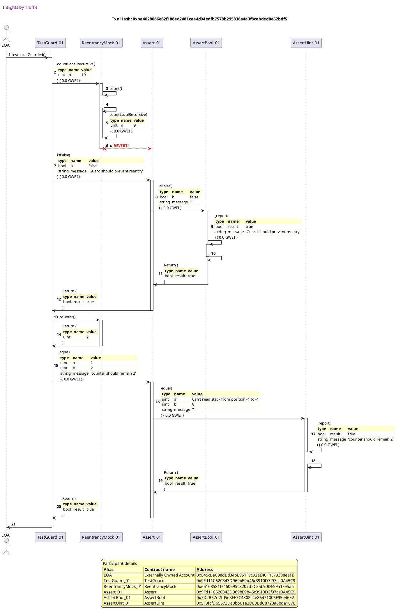

## testLocalCallVulnerable
[link to test...](http://github.com/cds-blog-code-samples/Reentrant/blob/21b80288141661bd6f89ab0fe6b2cbf29789200d/test/TestGuard.sol#L50)

##### d1, tx: 0x6a35a8005828b79067b6b151b61f89534d65c616ce4fe2470ce68e4473eaa4b1

[SVG :telescope:](https://www.planttext.com/api/plantuml/svg/xLLHRvim47xthx3QbqrTD3iOWgCiQa9WtSFKQklxTDWcGI4cCaPDskw_pn0MXQQRDFLrF1XyzzttdSzdWz1rPS7OUbCW1BKjTRr9bK7LEjTRCB31XLegBUSWrajJrbf6PL4QV9d4IHp524qgko_K5E7sMIcGok2dRehnJMdonr9RA6P5ljGRfQrZpEmHa3ZdWN9RcssXUexl-QF2b1rjTo1bhfUOaixqitrFFdP9e4x_YwxovSfMEDtZUrDdcUD5DhU5mlSxZM-WMeqnsGNW-H0IueV3C1rn4epI8AK-JGEQXTptc0ny4T10A9Qf8HiHeO9GCJRo501BAN8b4zQb7j_EC5Jumhqla2kRpKM-1RVKUrNPppKO-OFG5d5gw4DTQLMMQtM4dXhwq6_AbT605lklfLZ_nfzPBn1gCyA3wGjXV7KrngdAIgDY4Ajtxz4BVnFHqsyZQhtMvOCUvDegew4OQDYe9hWFFPSR3CRuDOdpb5iTKUhAchefRSF-2khj4b0KgUlfl_3_CRbQstyBE-JsVncuQyV6YGxt2hexwMkfBEH5XIRTxVBXSa4MX93fyoVihW_NvEuZAXjvON7JV8rX9gLHbVCTuwRFxObqu-xGgCKUtpwuziGpqQxRkSWkPhwOGyH3EPSUIsFkquGBFeIO4KhZaUVnK44oxnFtJlJ9jANaYQGq2eQHnxm53xWZJLaWF4x9miluI02PCJ_YVShUoJ-Ple7o_8PuQMl9arXcNiCIpFqu9aaOUaF22InWmQX8V4yo8KAMEdAtLzsEeMitkl_5Bm00)

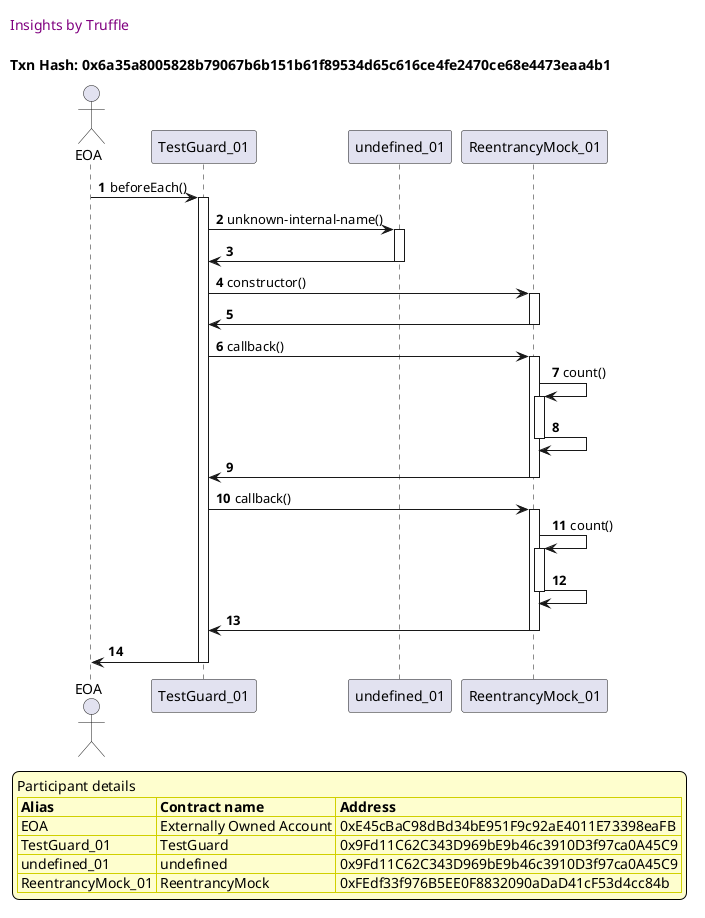

##### d2, tx: 0x1b56b1d98c50c815f3826df442378ae1cdbb95ae26e45ec69259d2112545e1bb

[SVG :telescope:](https://www.planttext.com/api/plantuml/svg/xLXRRzis57xNho2oXopeif6wAyY2shgq1JQqoBBjfK11aPGjcAPSaihYDllleovsV8ktt8O1im6Rvj7Xn-zyFAB4OrclbSPIrrDkMRZMbQYdEPEMcfHYXYMU0iv6JD0X9fEHh6f1uufN4doJfLaQfvPrhlISimiBj9ynmvH9yBNl0l2sakMNIcZC1xmSYIaJsY0MUkcGcOiTvAoMCyxMBlnIVc40kKlR1qnfAKO0mTxqPzkU_z2JiFhvtmbLZiPQWNmEhcHT50RNqgNc35pT2F0Mg_4PW3Sez_mSqIWa7YGXyWedj7rQkAxj125cYD0yZppCR9-v7YD-P7iHjH6oFTD5UMuPoOWsrDFt0u0LE3BjaMLaqoKfPzY4UiMKVbDZIJz1r7gi6jPTBvdHHc91vZzNPBBmtxAk3neenQHUE2zxkvo6LSNN7NlBBkTVIx61sbkEBAkD4fnUR0G3Nhqw0zfOVge8vZ7c_BUQ2oPnpjct9zQ6SpDyExOMWvWiqrVZKbqoKajLNhCLe8_YetNU9zztVNjn-oFGyna3fXLushRNcDVcJ-D-2sh37Tm2ORu8TiOJy1N0xo5uytlwpcJHBYv_Hx49wfyFEpqz0u-QvgMKY0v2T4A41o4w8OA349qG_a68JWZl84GdX7iGeXF2EGZH2M4VXEZVg0v2T48y-StoeH4T_F_3_Xl7dTPr-mXqTs9hyxDKvhJwo4pCpMdEP65klbhUcPMMpOdv5aoPKdXaxE0ugPW2ej9WZAyPm63KS3hUdRuh3Ey8BqwEpqcwm5pjPRsNu9BHFIG_IJQhf7uIIybKpVMBwBkFVfSxz_ejVIwPhgK0pntYoLOERAVsoqtziAe1atkU8SzCkz_vcoUWlOVknXtEFjUOFsb2l3BZqfYl6NVbPAyF69cqr2MPS4Q1hioWXzptYoBGCuOIOt6ipU9ZQcXZCW65hAPWLgbIbvK0fwXXUOfsn0iVlLaimxWdidzritZSmkmBONN3sE7tVzimkd9beudLrRAj3olrJieqBhbQOP7014BOi1Zm4gjc-hXgDXIYbtm6b9hfpRNbk8lRjWfiVc_CQWhC-Hoy_qEOnHoGTecRZBr9NOyCSHo5T4WTDqyZ3sKHYMoSkX2XD72SA6Gu6wu3hrMHLxejP9HHX6BVZXtNII8_Cg2vwnCdGZ1nYYWW60vSBuxM8RUhpPks5ZnBQU4qAFxGIrEOXQ5ZmmZY12Sk8fddK9UGqCtNmU-gqel_Js2wNhrUxRUWGM8F_O3Q1VMOawL1x8RG9YuBVJT04Ff6OkRwgRqBT57bNkste5xc5AH8VCyBd8GvUGuHjfCG3caS1ZR4VaunyWEp0racd_giibwRtthA_m80)

```plantuml


@startuml

autonumber
skinparam legendBackgroundColor #FEFECE

<style>
      header {
        HorizontalAlignment left
        FontColor purple
        FontSize 14
        Padding 10
      }
    </style>

header Insights by Truffle

title Txn Hash: 0x1b56b1d98c50c815f3826df442378ae1cdbb95ae26e45ec69259d2112545e1bb


actor EOA as "EOA"
participant TestGuard_01 as "TestGuard_01"
participant ReentrancyMock_01 as "ReentrancyMock_01"
participant Assert_01 as "Assert_01"
participant AssertBool_01 as "AssertBool_01"
participant AssertUint_01 as "AssertUint_01"

"EOA" -> "TestGuard_01" ++: testLocalCallVulnerable()
"TestGuard_01" -> "ReentrancyMock_01" ++: countThisRecursiveVulnerable(\n\
<#FEFECE,#FEFECE>|= type |= name |= value |\n\
| uint | n | 10 |\n\
) { 0.0 GWEI }
"ReentrancyMock_01" -> "ReentrancyMock_01" ++: count()
"ReentrancyMock_01" -> "ReentrancyMock_01" --: 
"ReentrancyMock_01" -> "ReentrancyMock_01" ++: countThisRecursiveVulnerable(\n\
<#FEFECE,#FEFECE>|= type |= name |= value |\n\
| uint | n | 9 |\n\
) { 0.0 GWEI }
"ReentrancyMock_01" -> "ReentrancyMock_01" ++: count()
"ReentrancyMock_01" -> "ReentrancyMock_01" --: 
"ReentrancyMock_01" -> "ReentrancyMock_01" ++: countThisRecursiveVulnerable(\n\
<#FEFECE,#FEFECE>|= type |= name |= value |\n\
| uint | n | 8 |\n\
) { 0.0 GWEI }
"ReentrancyMock_01" -> "ReentrancyMock_01" ++: count()
"ReentrancyMock_01" -> "ReentrancyMock_01" --: 
"ReentrancyMock_01" -> "ReentrancyMock_01" ++: countThisRecursiveVulnerable(\n\
<#FEFECE,#FEFECE>|= type |= name |= value |\n\
| uint | n | 7 |\n\
) { 0.0 GWEI }
"ReentrancyMock_01" -> "ReentrancyMock_01" ++: count()
"ReentrancyMock_01" -> "ReentrancyMock_01" --: 
"ReentrancyMock_01" -> "ReentrancyMock_01" ++: countThisRecursiveVulnerable(\n\
<#FEFECE,#FEFECE>|= type |= name |= value |\n\
| uint | n | 6 |\n\
) { 0.0 GWEI }
"ReentrancyMock_01" -> "ReentrancyMock_01" ++: count()
"ReentrancyMock_01" -> "ReentrancyMock_01" --: 
"ReentrancyMock_01" -> "ReentrancyMock_01" ++: countThisRecursiveVulnerable(\n\
<#FEFECE,#FEFECE>|= type |= name |= value |\n\
| uint | n | 5 |\n\
) { 0.0 GWEI }
"ReentrancyMock_01" -> "ReentrancyMock_01" ++: count()
"ReentrancyMock_01" -> "ReentrancyMock_01" --: 
"ReentrancyMock_01" -> "ReentrancyMock_01" ++: countThisRecursiveVulnerable(\n\
<#FEFECE,#FEFECE>|= type |= name |= value |\n\
| uint | n | 4 |\n\
) { 0.0 GWEI }
"ReentrancyMock_01" -> "ReentrancyMock_01" ++: count()
"ReentrancyMock_01" -> "ReentrancyMock_01" --: 
"ReentrancyMock_01" -> "ReentrancyMock_01" ++: countThisRecursiveVulnerable(\n\
<#FEFECE,#FEFECE>|= type |= name |= value |\n\
| uint | n | 3 |\n\
) { 0.0 GWEI }
"ReentrancyMock_01" -> "ReentrancyMock_01" ++: count()
"ReentrancyMock_01" -> "ReentrancyMock_01" --: 
"ReentrancyMock_01" -> "ReentrancyMock_01" ++: countThisRecursiveVulnerable(\n\
<#FEFECE,#FEFECE>|= type |= name |= value |\n\
| uint | n | 2 |\n\
) { 0.0 GWEI }
"ReentrancyMock_01" -> "ReentrancyMock_01" ++: count()
"ReentrancyMock_01" -> "ReentrancyMock_01" --: 
"ReentrancyMock_01" -> "ReentrancyMock_01" ++: countThisRecursiveVulnerable(\n\
<#FEFECE,#FEFECE>|= type |= name |= value |\n\
| uint | n | 1 |\n\
) { 0.0 GWEI }
"ReentrancyMock_01" -> "ReentrancyMock_01" ++: count()
"ReentrancyMock_01" -> "ReentrancyMock_01" --: 
"ReentrancyMock_01" -> "ReentrancyMock_01" ++: countThisRecursiveVulnerable(\n\
<#FEFECE,#FEFECE>|= type |= name |= value |\n\
| uint | n | 0 |\n\
) { 0.0 GWEI }
"ReentrancyMock_01" -> "ReentrancyMock_01" --: 
"ReentrancyMock_01" -> "ReentrancyMock_01" --: 
"ReentrancyMock_01" -> "ReentrancyMock_01" --: 
"ReentrancyMock_01" -> "ReentrancyMock_01" --: 
"ReentrancyMock_01" -> "ReentrancyMock_01" --: 
"ReentrancyMock_01" -> "ReentrancyMock_01" --: 
"ReentrancyMock_01" -> "ReentrancyMock_01" --: 
"ReentrancyMock_01" -> "ReentrancyMock_01" --: 
"ReentrancyMock_01" -> "ReentrancyMock_01" --: 
"ReentrancyMock_01" -> "ReentrancyMock_01" --: 
"ReentrancyMock_01" -> "TestGuard_01" --: 
"TestGuard_01" -> "Assert_01" ++: isTrue(\n\
<#FEFECE,#FEFECE>|= type |= name |= value |\n\
| bool | b | true |\n\
| string | message | 'Does not have a guard' |\n\
) { 0.0 GWEI }
"Assert_01" -> "AssertBool_01" ++: isTrue(\n\
<#FEFECE,#FEFECE>|= type |= name |= value |\n\
| bool | b | false |\n\
| string | message | '' |\n\
) { 0.0 GWEI }
"AssertBool_01" -> "AssertBool_01" ++: _report(\n\
<#FEFECE,#FEFECE>|= type |= name |= value |\n\
| bool | result | true |\n\
| string | message | 'Does not have a guard' |\n\
) { 0.0 GWEI }
"AssertBool_01" -> "AssertBool_01" --: 
"AssertBool_01" -> "Assert_01" --: Return (\n\
<#FEFECE,#FEFECE>|= type |= name |= value |\n\
| bool | result | true |\n\
)
"Assert_01" -> "TestGuard_01" --: Return (\n\
<#FEFECE,#FEFECE>|= type |= name |= value |\n\
| bool | result | true |\n\
)
"TestGuard_01" -> "ReentrancyMock_01" ++: counter()
"ReentrancyMock_01" -> "TestGuard_01" --: Return (\n\
<#FEFECE,#FEFECE>|= type |= name |= value |\n\
| uint |  | 12 |\n\
)
"TestGuard_01" -> "Assert_01" ++: equal(\n\
<#FEFECE,#FEFECE>|= type |= name |= value |\n\
| uint | a | 12 |\n\
| uint | b | 12 |\n\
| string | message | 'counter got tickled to 12' |\n\
) { 0.0 GWEI }
"Assert_01" -> "AssertUint_01" ++: equal(\n\
<#FEFECE,#FEFECE>|= type |= name |= value |\n\
| uint | a | Can't read stack from position -1 to -1 |\n\
| uint | b | 0 |\n\
| string | message | '' |\n\
) { 0.0 GWEI }
"AssertUint_01" -> "AssertUint_01" ++: _report(\n\
<#FEFECE,#FEFECE>|= type |= name |= value |\n\
| bool | result | true |\n\
| string | message | 'counter got tickled to 12' |\n\
) { 0.0 GWEI }
"AssertUint_01" -> "AssertUint_01" --: 
"AssertUint_01" -> "Assert_01" --: Return (\n\
<#FEFECE,#FEFECE>|= type |= name |= value |\n\
| bool | result | true |\n\
)
"Assert_01" -> "TestGuard_01" --: Return (\n\
<#FEFECE,#FEFECE>|= type |= name |= value |\n\
| bool | result | true |\n\
)
"TestGuard_01" -> "EOA" --: 

legend
Participant details
<#FEFECE,#D0D000>|= Alias |= Contract name |= Address |
<#FEFECE>| EOA | Externally Owned Account | 0xE45cBaC98dBd34bE951F9c92aE4011E73398eaFB |
<#FEFECE>| TestGuard_01 | TestGuard | 0x9Fd11C62C343D969bE9b46c3910D3f97ca0A45C9 |
<#FEFECE>| ReentrancyMock_01 | ReentrancyMock | 0xFEdf33f976B5EE0F8832090aDaD41cF53d4cc84b |
<#FEFECE>| Assert_01 | Assert | 0x9Fd11C62C343D969bE9b46c3910D3f97ca0A45C9 |
<#FEFECE>| AssertBool_01 | AssertBool | 0x7D2B67d2fd5e3FE7C4802c4e86471006E95e46E2 |
<#FEFECE>| AssertUint_01 | AssertUint | 0x5F3fcfD65573De3bb01a2D80BdC8720a6bda1670 |
endlegend

@enduml
```

## testLocalCallGuarded
[link to test...](http://github.com/cds-blog-code-samples/Reentrant/blob/21b80288141661bd6f89ab0fe6b2cbf29789200d/test/TestGuard.sol#L62)

##### d1, tx: 0x89a17b2db38bd99eabd91f158e5dd9f2a60c026e3a3b3e140722a525ce4c9d38

[SVG :telescope:](https://www.planttext.com/api/plantuml/svg/xLLDRzim3BthLmZjPKCNJF97OXLTqCHnrXs65bll0otHYH573cGPJThklqzsl21kkW53h_D1jiZ7zoYAaWcvhYmOMwyBGg2sfQxNAHfIhNAz0GDhMk02jPg2N2rCMMiLbqLfwFaycITnGiXLPNS5ZWbjdoM2GaEVkYcbDwN97qjjePWK-KAlKLl7cDa3OEwSUyfDRJO5zXpVyqUaF3ZOxa2fN2yePvtfP_k--jWbGJhzBxhA5qjRqNH7xqsTPOwNsDmMIE-tcjv0jRoaR1i9uAFKKwaVfKe813VoZ8SHXag9p8CXaymReWz-wYCFsCZp8FH2YO4Koe-8AvcqBlNaTaAXecVkVKPSsMmkymsufTvZPJ_NODGFnbl4iQ4FTQN5BDTuW1uR-j1lwCfeGClTrrAkVkDFh6U4j1dHmVY5CBsukAGfPgN11EJotNlomjz4zFJRY5glTFcW1xcsQ3GK0mrhR8Bxq5EvmU2IlYPncdAh8qjTMLCtfMtONq6zNGAA8dKz_HV-FoPNQ_jlOVlS_Y-3TktOECd-NY5tHtsjq49ULEIgkrq-dC_OZ34sVlv4tVNXcjnzn6KZBorjcgynJ9GoM3dV8Mxyt9v8DsxtZLhiwEs3QqywaUswdOjjao2KKuX5fARA3z94X7mkfF0W2HZdoSZtHOGmd_Q9UoVwQDfIYhdYF1vwiH_uCp4KZZGDXj8NdCtyJ8mai4aGng9FsJlvHzCtK9xU42zjBNauau4FIWGeKi3Hb2SY4guMFav6wH052pD4BXD7xlQgsp5oxKRtl_W5)

##### d2, tx: 0xaab6aa669dd89d23fab404bf5eeacbafc07409ad9d3b64be3fe576f4f0b65a15

[SVG :telescope:](https://www.planttext.com/api/plantuml/svg/vLTjRzis4FwkNy6bmDAaoqgzMu5dr9Rbja275bcsVLY7uYIU726ov95K6hVPV-z9bXs_9McJh5zcMA9uF1sVvtWy7GtZXT8WTJN93GCgNHRL94PfgFEic8A42SjnZ8KOG78-bcLLYB3CIycUZA9H54Q6qLLwbcFFOCtl346WP9_RBcElIfbzAWiDUJ_FniK42qqMKxrK6D7WtEIqajCSrmP-opuXCvsbx1q8aHLZPl9Mz6_JTf-t88ns_jU5oiPdMh5unavbbQParz2Ppf6TNXRi5QYpOyOl0M8FmFC28Jg1iEmKOeSxSUeYGX93cd3VuG68GDYnvyHef-ZwNkgaFFPSC5s3N9PeWXwzxJDGR8_QFOFSfhCacm9HFKMbNrOWnGTkDXghWdNL4oJVI2YIsQzbShxGtvAklzHN2gLUA2zxkvG6PPclAxQINSg_PyM6rLQoPnWDItRKso33dZqxPfeaRye4yX3ol1b2yVJ0sD2itzqcrXX8ACJqwLccJZ2ffCekyEdxuhtHRUFjfxRjNVt2z6oAZDe29arx0Nb53xNw5Qi8BhjY1LqcdmiFs6V6V-RivP_HQmgSNGZk0bPJ-VhNZewEsRscULp-mLVJlppwwub4yNUDxpgM6XxT7p-2B6ZlzLWtcMS0qkmT7fv4VqGdfpyS7dQVD_AU8MZpwEm2DEuCtpk6TuJA2fJQHPaQGQxkwPUOOfvy4jELrbOMSgLbdLYks0ILWZ79sNw3Wgcpiie5cqgyg9ENR23FzX_WrCM--rR7hgt9jhNlwfiR-6yIt8toWyHfAVM3K4fKLLw7k9RLOw_YtIpcM_j6lQNE2UfA5koncHvinSB6hlbFf_wsP8xobgpvoB3Rh4T_wnQq6_a4_waWVz1yS3tXKXQlodR5PUiSDYurew_lUOw2wP9PjyRa1eV5H_aHUOHGxDVx0sZFQ2hwM2hB2PkMAjDPMR0ZimP9zsss_DxvOadZ1cRVDL_SQrrkOx2QAtRe_TzonRnwh7rYp8yMnhkLybEWXYnNAoY6VCWvhr7G2OBgKNe8opgN97g9foy4JKzZo_TwLqrHJlTBMio2gj4PU_kneBNi9yqArm5x6JbkCe0mw8Y1i9qu2bnp52I11P73JJFoRJle88m6wuRNYlgLRcCo60dJ33qhj1rx67W16OqTBx43am_jDF0Ju7t73ODrazl5_wQiCUuE4yUcyuY3GGpe3ymew0G4tCQ-7tiOS3T5D9DetVZr8M7n_02awuU9rNvZr1zQ0yyNLYfSj4UH7peTRYKETZp7DpdtoCNeU96ro-ZYqB7QdzCUsMcI3ZtNzUqXsd7CJR267JuGOSUtE7Yn0DFpAG4P54zjL1alw4x7sYy0)

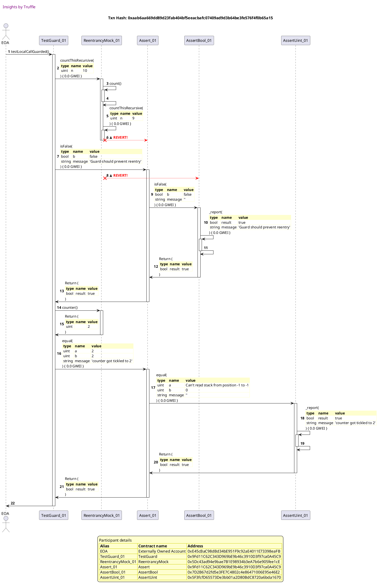

## testBadContractExploit
[link to test...](http://github.com/cds-blog-code-samples/Reentrant/blob/21b80288141661bd6f89ab0fe6b2cbf29789200d/test/TestGuard.sol#L74)

##### d1, tx: 0xb0efe1005f6e8f3999bcb71bc33577773c4fa226d26f79fd26a71e4204448fa0

[SVG :telescope:](https://www.planttext.com/api/plantuml/svg/xLLBRzim3BxhLmZjPKCNJBBbXu8iQEBOwmv3YwttGTOZCUB8WIoZITlzzycE5yHDDs3eTJf85ldn8qLHD03NjMN6DfiI0DROIZURN1fGhmkzPOPjO2cNKeivu-kbgHejaggi3BpCqYnDKW0cjTsNSWfWDrQI2MdWKx-5yAOonMEbBIjdPR7K6wcjOrJs2CYSya2vRSosb0F5z-9HGaoEiZicHA6N4ADUzBDR9n_x843l_ukkY-NArZ3VmtlJAELuWIriAU7zJiCRLg_64Ero99N420KgbB7oAQKvpoESSzyF8ZTyJXJpl51ueOgeSWkBi2GU8eJ4YY7WKiQj2pszdK5MmmktNW2NDblmOilSKUzbRJytp8WV27U8Ky4Gwb8hLQ7b4Neg64A_IPT6mpJVVwtu-ZV-J7e1G1SH74rVE8PNLsEOIrKPcJA-UlSUlD2t5WF_dKMZrxfwqAD2MsaqAqUQRMHhF8IUknkDnl0r5-SXTtvufMjhcZQrBVihgBUxO6MPkvh-2_yVWskq_JUpGsp_Zm7xScoLuD1NmDr9NGjfML7MOD9tbm-N2xH024sVFq7NFboHku-aQjrp2zlYQmKp8OoidUveDttkNgIRTuT2BVVmzi6L9vpnxjnEXNOf2VYS9JGMS-6JFAK1pYYd7ai9mZYDV9_6acNp8V7WHPziEqgQ2OoJq4jyuYzeI1rfJaBkKumMlg8HPsX6WeGEAGSl_sJx1ihp3l5ITaX1acEM4JhtK4133-SYYR4Nnv68i4S35OGacbF27Bcxg_x6mBMRtV_Y5m00)

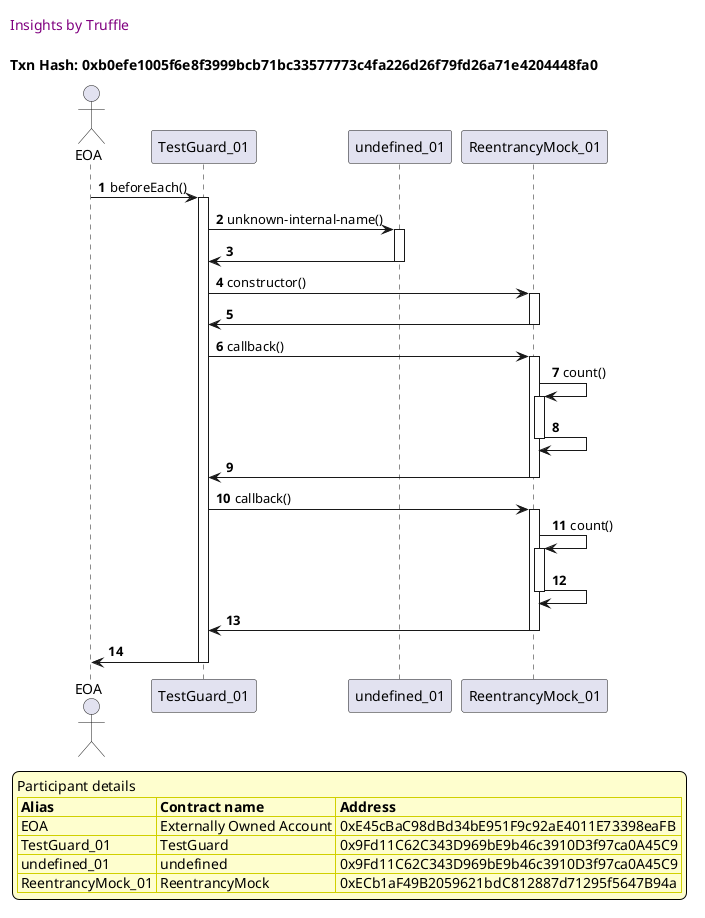

##### d2, tx: 0x5ef5b17b8cb007ac2c1fb3ab7592ad2479c9bb073f9f4f6204500b86c5aaff1e

[SVG :telescope:](https://www.planttext.com/api/plantuml/svg/vLTPSzis47xdhq2TJdsaQi2RzAYQY1APvA6JZEEs3qqd0nAWp345gY1eMudwtxkaI9cKABi-cfTg989OBBuziBl2AihhN18XYtcgAAIG6I_c8HDAVfdm1H5aZb8sOvnw9BgSYQpWT9AbcK0l0Z_m9xwY37EvJDb8GTNdWX7A1FfQJn5wcudaIyObISTfCkDpnYKWndB34C3Y6d9HY4NAEWiVaoyCgSQ6ze5Gcl0PKd5D-hiQXwzg9PHQ_ZkU9xCBcQDmYSv54SU0gyX4fWoTtt3qbkGNfmZVc2msGzKEdIZ4s2QH5gbng9FGDbsDKCsmtSWDGsphiHiRiQLXmyGuTAp892IELS1KI2H1TV_z694S7S1ue83RP18b2mAcdhDSlYc8e9-nMd6q2LrMS2sB4yush6r2b_MCWHi5uT5oB2KSJBEZXxvluozPtxQQsjqqpdCcPCEycVKnULcMTXbhIX_phmdVGgqf1ufIUH8DHbiEGozVdY8958z079PAHzA_MQHP8e-EbItUSdV7XzNkWb_ox9eFG1GJdAG3JkQitDnbtHKz69oYFX5zJgyaHHdFfIZA02dnU_aU8wOvf5f8mUKOifAawT4d_aaPrfdvOpsELZyZkLmm16DfQZbUaRI0bv9zLQfP-H6j4AaKW_nPGNBeM6EwfmUEFtLq4kXZGpUcOnDo8hPf79YgwLkUPsleQDkoupNqCVgAy4yOlVdTVmU9scV1VOPr_NRVjhNhxkNVFYRmt4UeSEoEK_hZnKp0mfzx19-Yx_VQseAv0Hp1Q8LocqQLsiCVhedWKDf6Q1Yj2onmZavEplpV_BFpxqvEXgyg-aYX30uhkIAIxKduVePDQlV4LakPqYD97f0qPuyBfn0I7k8dX5zSeZHqI8MoSg_GdEKvcG4T7LPQeFmYArAA5e9TbVyEeb9vUVYlWsZNhKtHUQXhEwUoY_PDVRF7_cq3-xNyBDWY4_99MWgM5sbP5Q26FVSftc_5EfVtycrupfWi14VFRUdnJYpiLkd_JlJ3glzsuUgKlMTMku2_JT0MljeTscxL4_PNGT8doIEt0ZUqi4thYylQEKra2ZOd2KVQdI6vPK9p8Nb6CoQ47vRfGI1bofADOf7DqIBB4vba70rK9BFokMiiVdIvs9Ynnx9lMYuUSont6T2k53ry_xTAiRuubpvHrfsRyg5rywPCaYJDMrfCyHHZN6e13HfSnU6bkLblz1bJ2k9XRRDljAfw7dZUhA_HwHAzluRBCnf7rG5NLqZVC2EFJ5o7UbGtGjyrrG1QAetu1bPLtzPrrs4ayBh0dPwfDQqWtO2gwiJI9hgXJrtB1T3Gi2BTLV4KsZGx8dXic1Et2zdfhLhJ9q3szM2xr8VTfFS8Q7grRThQnvDG9O7XUXesNKjJGpfnLCrnR6ghccl6fcNOdckGBlXjJzUyFy4LtTwlFQz0xQdcMJRLOceoFV3jYU5WBJAO0vgf65iG5iomVAqFjEaHs_CAr0pqE8gdbcdQ-fJfqAMhH9iws0FpRGqJAwH4jMoecGhaG9q9ocju5lFq7m00)

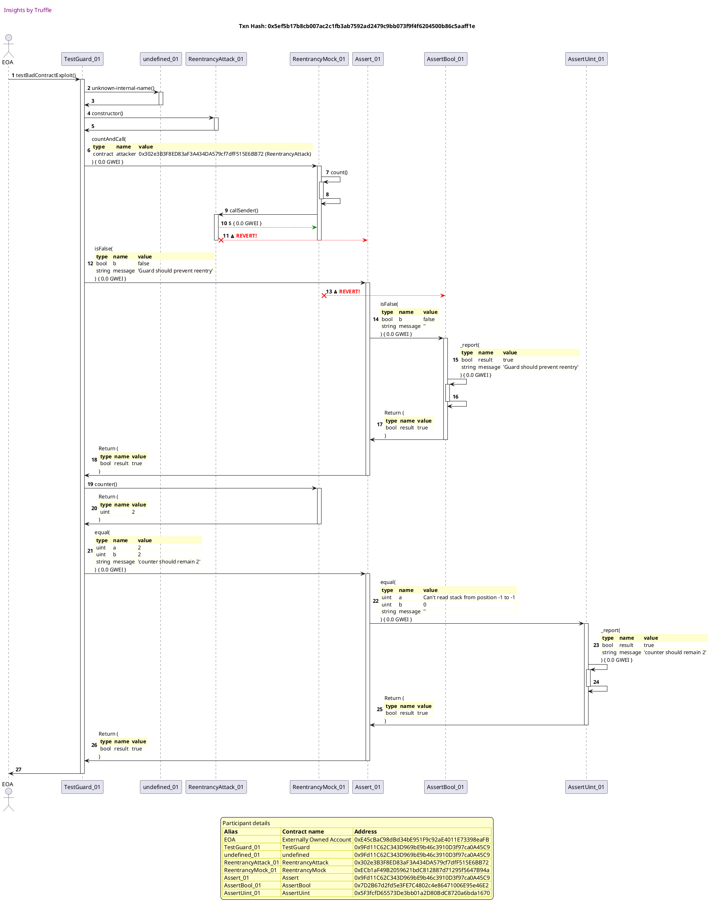

## testAnotherFunctionVulnerable
[link to test...](http://github.com/cds-blog-code-samples/Reentrant/blob/21b80288141661bd6f89ab0fe6b2cbf29789200d/test/TestGuard.sol#L88)

##### d1, tx: 0xefcd01e757ab6b32d94963f3e62c2d400ad96c229b61f90dbc64201463f38c14

[SVG :telescope:](https://www.planttext.com/api/plantuml/svg/xLN1Rjim3BthAuJsig4B9bco4nLTqCHnrXs65bllWop9YH573cGPJThktqSxNX0ttO2Xr_aWc-JZ8qLHD4BNbPVEr-i28LdxqjRhr3XKhNAxaKwkSM4MnkgfLAk5Askhux8e7JwV9_CaJX2wglokC6E4ssTff3OEFtKYnZUbonzBwsKnAVA5NHlhWJ7p1y0SZ7lAJUqsXUaPlkUF1bD-qDr9hNExm9Hqgf_j--fZbmJgud-nLRvO-WgdEtplwYm3NkHpNnXylxNuHbRBIqos9bEQK3CCXpADKXPemKN4CcQYG0MQ4oArY5GGY3IYcI0wLH4F2EKDPgGWBoYPyf1wSZl1ii9dy3v3K3QVgtmZOQltflAVQ-dq3q9RnB6Y3uNIcYotvW0zLlIXtmoKqKchTbzBjVgDFz6U8THcX0VZ5u7nnSKbJarMEfD8jNpt7hsmDnwz-Ar7RLUsVB23t7hZh2m6LgvDuzo7deOR32xnQo5EKsxZgD9MtjLDQHlsLr1l3o6B8eMU_Wl_7vEhhVytjtrk_xU1ktPiZ6W_Lz3TKLzhusLULEYgcouVpcTaHWWPFt_2C3wWoU4ZBflmokEc-Hh5H6jdAh0T_CRFxOs4TRjlr6A7Rn-WFV54jVi64zacF5HJ6OkHdch6qqI4T2wK26J22QN9a34nCd8-xHFtRlIHs5AAkQOqZeAOSJOJaG3Ib4UA2KfcB1D39Sc4Xx7eK_Pk_f7u1ihJ2V5Irv9pncOi6GOXvv4GB1g9W2L0Dg9KQJcRZ0AGmX3AZE2ikXD3rx32_-8N)

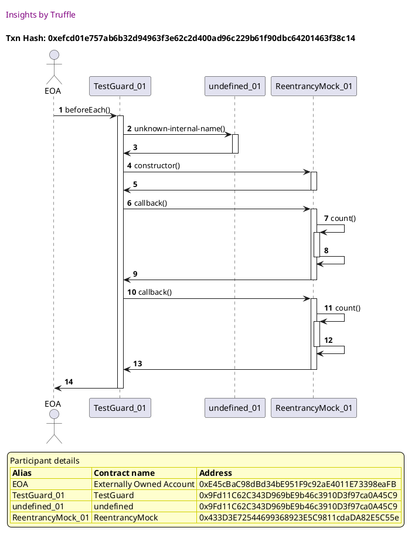

##### d2, tx: 0xadceeb89e6d5e64695afdd3ad27e81c026e43239c96ed2772ef1a797a837467c

[SVG :telescope:](https://www.planttext.com/api/plantuml/svg/xLfjRzis4FwkNq5a7xAWooQ9UWsoe7wHcm8RMcJP-gL0GP4dMmXDUHILnMtstqSfakAtUCjB1moZ0OlcwNXyxj7fS33FibwNYaXLpRbbaKeLefgd8AtoAXSB8iaSSPY2O4D2hwQog0GR5RoGw9j9Cab6YMMTbch9uSn2pMS6X854NzefGkU5p3yNGX4-uFbKp44eRJ5JlS94txmpkQZaWiFQZL_opu0ShvUz9upbOeeSknNzsOodFxGWh7R_jwBCfpDLedI9BcMLPTgkfNB50LtU27HEoja9icy8em1f54F0V0Yy8FP9nXWcp0qXSgZj1k1X5ySq3a3BGXSoXuHnI28SUa58BKqPLHfwycw0I8aEz7XWQTfKJlC5qQvUGgdUL4IoJxRJQAmArbKlG7CZYQ3BdmjwrUblITSN3SeIfEgK-zakfM5Hy7N5Lh9B-TTSR5Xj9GUMrNY9Ziysd46lNfqWfIK3KQWPo4abgCeByLl51KYISlZsoDfOKXlPzh2nH7MigG-vcfq3Nu1SiV9HVBHEs_ZxhXtFRdz4Qha0f4T1viruJNYbVzJgjwZIyD4j4lhhs7V28_G5sT_RwCs7vAqEf5r0_WvVxT4_NtPyV8AUjCrF1INy0cWbo_mQNf0Arr3HHqLigEYeY0mL7HMXeQAZ8Z1KT5JuXegE2izGqL613HKT5QwXegF2CLIOmdkJ2bDiTaoOMhDZmfIQ7HEcqkoOC8LcnuIfCpicJ9dP_trbcEXAAyD4oyIpQyp7kcJqZRxH_u_eRnm_DQhRHrBtvsXDmihBIrazCJEbHS5rLahrLybxSQbaVOvvY-PGbcIgvUXmN429HA7GZ5m38cXQOphSdSvM4Du3xixpNX9qHdYv5_LUW3sY1q1-ah0ef7eMIWbbnTLNuNSV_BlOUL2lrxa0LKc1Njh5ewqOs0xjhxVruqvnGUufAbuOTbi9rCKXtWDtums7tol2dxKXMTcn5wPhmbqnsVA3obbHSQRPdfDSw3MFUUsxa_aNz6H4nA7IQ0ZJg0czGfaivcXHb7bzee-E7QIA-hhjhltaND6xyO1d_sgkUD9psUV1QhhOeVT_InTtBIGr9zPTVv7rVgK7XO4YEIzNK8pjiMtRDOe1pqbPRpygwdH2LOzdm9ZUNj_hrvtTDfqv-dgZ7wOWd2_Hkpy4C3IWpHEk0_OcyNmw9ACuOaE6lJI9VMSIqzWbYMSxJX9Y74T09iDrmskTFIlJncGyOOup2jmHzl0u3c9jDFK2YcF77kCi3Ycn1vu_YjTDRdS0RSeQunx6Ovo4hkzvGHpZ88fTd6XZaUDGHiQ3oDKptuTru_UTGjtlPo1TxoXQdJT6mx4x34BcPim7F4d2aHVPBlKW2hpGiUr0KmnUaBYxZ7QTHwlpngW_mHdDne7lXtWCE4rjXxZZo1woKHIwDWbIHfmWr0d8ql7KHfNrMb-hEVyB)

```plantuml


@startuml

autonumber
skinparam legendBackgroundColor #FEFECE

<style>
      header {
        HorizontalAlignment left
        FontColor purple
        FontSize 14
        Padding 10
      }
    </style>

header Insights by Truffle

title Txn Hash: 0xadceeb89e6d5e64695afdd3ad27e81c026e43239c96ed2772ef1a797a837467c


actor EOA as "EOA"
participant TestGuard_01 as "TestGuard_01"
participant ReentrancyMock_01 as "ReentrancyMock_01"
participant Assert_01 as "Assert_01"
participant AssertBool_01 as "AssertBool_01"
participant AssertUint_01 as "AssertUint_01"

"EOA" -> "TestGuard_01" ++: testAnotherFunctionVulnerable()
"TestGuard_01" -> "ReentrancyMock_01" ++: countWithHelperVulnerable(\n\
<#FEFECE,#FEFECE>|= type |= name |= value |\n\
| uint | n | 10 |\n\
) { 0.0 GWEI }
"ReentrancyMock_01" -> "ReentrancyMock_01" ++: count()
"ReentrancyMock_01" -> "ReentrancyMock_01" --: 
"ReentrancyMock_01" -> "ReentrancyMock_01" ++: countLocalRecursiveVulnerable(\n\
<#FEFECE,#FEFECE>|= type |= name |= value |\n\
| uint | n | 20 |\n\
) { 0.0 GWEI }
"ReentrancyMock_01" -> "ReentrancyMock_01" ++: count()
"ReentrancyMock_01" -> "ReentrancyMock_01" --: 
"ReentrancyMock_01" -> "ReentrancyMock_01" ++: countLocalRecursiveVulnerable(\n\
<#FEFECE,#FEFECE>|= type |= name |= value |\n\
| uint | n | 19 |\n\
) { 0.0 GWEI }
"ReentrancyMock_01" -> "ReentrancyMock_01" ++: count()
"ReentrancyMock_01" -> "ReentrancyMock_01" --: 
"ReentrancyMock_01" -> "ReentrancyMock_01" ++: countLocalRecursiveVulnerable(\n\
<#FEFECE,#FEFECE>|= type |= name |= value |\n\
| uint | n | 18 |\n\
) { 0.0 GWEI }
"ReentrancyMock_01" -> "ReentrancyMock_01" ++: count()
"ReentrancyMock_01" -> "ReentrancyMock_01" --: 
"ReentrancyMock_01" -> "ReentrancyMock_01" ++: countLocalRecursiveVulnerable(\n\
<#FEFECE,#FEFECE>|= type |= name |= value |\n\
| uint | n | 17 |\n\
) { 0.0 GWEI }
"ReentrancyMock_01" -> "ReentrancyMock_01" ++: count()
"ReentrancyMock_01" -> "ReentrancyMock_01" --: 
"ReentrancyMock_01" -> "ReentrancyMock_01" ++: countLocalRecursiveVulnerable(\n\
<#FEFECE,#FEFECE>|= type |= name |= value |\n\
| uint | n | 16 |\n\
) { 0.0 GWEI }
"ReentrancyMock_01" -> "ReentrancyMock_01" ++: count()
"ReentrancyMock_01" -> "ReentrancyMock_01" --: 
"ReentrancyMock_01" -> "ReentrancyMock_01" ++: countLocalRecursiveVulnerable(\n\
<#FEFECE,#FEFECE>|= type |= name |= value |\n\
| uint | n | 15 |\n\
) { 0.0 GWEI }
"ReentrancyMock_01" -> "ReentrancyMock_01" ++: count()
"ReentrancyMock_01" -> "ReentrancyMock_01" --: 
"ReentrancyMock_01" -> "ReentrancyMock_01" ++: countLocalRecursiveVulnerable(\n\
<#FEFECE,#FEFECE>|= type |= name |= value |\n\
| uint | n | 14 |\n\
) { 0.0 GWEI }
"ReentrancyMock_01" -> "ReentrancyMock_01" ++: count()
"ReentrancyMock_01" -> "ReentrancyMock_01" --: 
"ReentrancyMock_01" -> "ReentrancyMock_01" ++: countLocalRecursiveVulnerable(\n\
<#FEFECE,#FEFECE>|= type |= name |= value |\n\
| uint | n | 13 |\n\
) { 0.0 GWEI }
"ReentrancyMock_01" -> "ReentrancyMock_01" ++: count()
"ReentrancyMock_01" -> "ReentrancyMock_01" --: 
"ReentrancyMock_01" -> "ReentrancyMock_01" ++: countLocalRecursiveVulnerable(\n\
<#FEFECE,#FEFECE>|= type |= name |= value |\n\
| uint | n | 12 |\n\
) { 0.0 GWEI }
"ReentrancyMock_01" -> "ReentrancyMock_01" ++: count()
"ReentrancyMock_01" -> "ReentrancyMock_01" --: 
"ReentrancyMock_01" -> "ReentrancyMock_01" ++: countLocalRecursiveVulnerable(\n\
<#FEFECE,#FEFECE>|= type |= name |= value |\n\
| uint | n | 11 |\n\
) { 0.0 GWEI }
"ReentrancyMock_01" -> "ReentrancyMock_01" ++: count()
"ReentrancyMock_01" -> "ReentrancyMock_01" --: 
"ReentrancyMock_01" -> "ReentrancyMock_01" ++: countLocalRecursiveVulnerable(\n\
<#FEFECE,#FEFECE>|= type |= name |= value |\n\
| uint | n | 10 |\n\
) { 0.0 GWEI }
"ReentrancyMock_01" -> "ReentrancyMock_01" ++: count()
"ReentrancyMock_01" -> "ReentrancyMock_01" --: 
"ReentrancyMock_01" -> "ReentrancyMock_01" ++: countLocalRecursiveVulnerable(\n\
<#FEFECE,#FEFECE>|= type |= name |= value |\n\
| uint | n | 9 |\n\
) { 0.0 GWEI }
"ReentrancyMock_01" -> "ReentrancyMock_01" ++: count()
"ReentrancyMock_01" -> "ReentrancyMock_01" --: 
"ReentrancyMock_01" -> "ReentrancyMock_01" ++: countLocalRecursiveVulnerable(\n\
<#FEFECE,#FEFECE>|= type |= name |= value |\n\
| uint | n | 8 |\n\
) { 0.0 GWEI }
"ReentrancyMock_01" -> "ReentrancyMock_01" ++: count()
"ReentrancyMock_01" -> "ReentrancyMock_01" --: 
"ReentrancyMock_01" -> "ReentrancyMock_01" ++: countLocalRecursiveVulnerable(\n\
<#FEFECE,#FEFECE>|= type |= name |= value |\n\
| uint | n | 7 |\n\
) { 0.0 GWEI }
"ReentrancyMock_01" -> "ReentrancyMock_01" ++: count()
"ReentrancyMock_01" -> "ReentrancyMock_01" --: 
"ReentrancyMock_01" -> "ReentrancyMock_01" ++: countLocalRecursiveVulnerable(\n\
<#FEFECE,#FEFECE>|= type |= name |= value |\n\
| uint | n | 6 |\n\
) { 0.0 GWEI }
"ReentrancyMock_01" -> "ReentrancyMock_01" ++: count()
"ReentrancyMock_01" -> "ReentrancyMock_01" --: 
"ReentrancyMock_01" -> "ReentrancyMock_01" ++: countLocalRecursiveVulnerable(\n\
<#FEFECE,#FEFECE>|= type |= name |= value |\n\
| uint | n | 5 |\n\
) { 0.0 GWEI }
"ReentrancyMock_01" -> "ReentrancyMock_01" ++: count()
"ReentrancyMock_01" -> "ReentrancyMock_01" --: 
"ReentrancyMock_01" -> "ReentrancyMock_01" ++: countLocalRecursiveVulnerable(\n\
<#FEFECE,#FEFECE>|= type |= name |= value |\n\
| uint | n | 4 |\n\
) { 0.0 GWEI }
"ReentrancyMock_01" -> "ReentrancyMock_01" ++: count()
"ReentrancyMock_01" -> "ReentrancyMock_01" --: 
"ReentrancyMock_01" -> "ReentrancyMock_01" ++: countLocalRecursiveVulnerable(\n\
<#FEFECE,#FEFECE>|= type |= name |= value |\n\
| uint | n | 3 |\n\
) { 0.0 GWEI }
"ReentrancyMock_01" -> "ReentrancyMock_01" ++: count()
"ReentrancyMock_01" -> "ReentrancyMock_01" --: 
"ReentrancyMock_01" -> "ReentrancyMock_01" ++: countLocalRecursiveVulnerable(\n\
<#FEFECE,#FEFECE>|= type |= name |= value |\n\
| uint | n | 2 |\n\
) { 0.0 GWEI }
"ReentrancyMock_01" -> "ReentrancyMock_01" ++: count()
"ReentrancyMock_01" -> "ReentrancyMock_01" --: 
"ReentrancyMock_01" -> "ReentrancyMock_01" ++: countLocalRecursiveVulnerable(\n\
<#FEFECE,#FEFECE>|= type |= name |= value |\n\
| uint | n | 1 |\n\
) { 0.0 GWEI }
"ReentrancyMock_01" -> "ReentrancyMock_01" ++: count()
"ReentrancyMock_01" -> "ReentrancyMock_01" --: 
"ReentrancyMock_01" -> "ReentrancyMock_01" ++: countLocalRecursiveVulnerable(\n\
<#FEFECE,#FEFECE>|= type |= name |= value |\n\
| uint | n | 0 |\n\
) { 0.0 GWEI }
"ReentrancyMock_01" -> "ReentrancyMock_01" --: 
"ReentrancyMock_01" -> "ReentrancyMock_01" --: 
"ReentrancyMock_01" -> "ReentrancyMock_01" --: 
"ReentrancyMock_01" -> "ReentrancyMock_01" --: 
"ReentrancyMock_01" -> "ReentrancyMock_01" --: 
"ReentrancyMock_01" -> "ReentrancyMock_01" --: 
"ReentrancyMock_01" -> "ReentrancyMock_01" --: 
"ReentrancyMock_01" -> "ReentrancyMock_01" --: 
"ReentrancyMock_01" -> "ReentrancyMock_01" --: 
"ReentrancyMock_01" -> "ReentrancyMock_01" --: 
"ReentrancyMock_01" -> "ReentrancyMock_01" --: 
"ReentrancyMock_01" -> "ReentrancyMock_01" --: 
"ReentrancyMock_01" -> "ReentrancyMock_01" --: 
"ReentrancyMock_01" -> "ReentrancyMock_01" --: 
"ReentrancyMock_01" -> "ReentrancyMock_01" --: 
"ReentrancyMock_01" -> "ReentrancyMock_01" --: 
"ReentrancyMock_01" -> "ReentrancyMock_01" --: 
"ReentrancyMock_01" -> "ReentrancyMock_01" --: 
"ReentrancyMock_01" -> "ReentrancyMock_01" --: 
"ReentrancyMock_01" -> "ReentrancyMock_01" --: 
"ReentrancyMock_01" -> "ReentrancyMock_01" --: 
"ReentrancyMock_01" -> "TestGuard_01" --: 
"TestGuard_01" -> "Assert_01" ++: isTrue(\n\
<#FEFECE,#FEFECE>|= type |= name |= value |\n\
| bool | b | true |\n\
| string | message | 'Does not have a guard' |\n\
) { 0.0 GWEI }
"Assert_01" -> "AssertBool_01" ++: isTrue(\n\
<#FEFECE,#FEFECE>|= type |= name |= value |\n\
| bool | b | false |\n\
| string | message | '' |\n\
) { 0.0 GWEI }
"AssertBool_01" -> "AssertBool_01" ++: _report(\n\
<#FEFECE,#FEFECE>|= type |= name |= value |\n\
| bool | result | true |\n\
| string | message | 'Does not have a guard' |\n\
) { 0.0 GWEI }
"AssertBool_01" -> "AssertBool_01" --: 
"AssertBool_01" -> "Assert_01" --: Return (\n\
<#FEFECE,#FEFECE>|= type |= name |= value |\n\
| bool | result | true |\n\
)
"Assert_01" -> "TestGuard_01" --: Return (\n\
<#FEFECE,#FEFECE>|= type |= name |= value |\n\
| bool | result | true |\n\
)
"TestGuard_01" -> "ReentrancyMock_01" ++: counter()
"ReentrancyMock_01" -> "TestGuard_01" --: Return (\n\
<#FEFECE,#FEFECE>|= type |= name |= value |\n\
| uint |  | 23 |\n\
)
"TestGuard_01" -> "Assert_01" ++: equal(\n\
<#FEFECE,#FEFECE>|= type |= name |= value |\n\
| uint | a | 23 |\n\
| uint | b | 23 |\n\
| string | message | 'counter should remain 23' |\n\
) { 0.0 GWEI }
"Assert_01" -> "AssertUint_01" ++: equal(\n\
<#FEFECE,#FEFECE>|= type |= name |= value |\n\
| uint | a | Can't read stack from position -1 to -1 |\n\
| uint | b | 0 |\n\
| string | message | '' |\n\
) { 0.0 GWEI }
"AssertUint_01" -> "AssertUint_01" ++: _report(\n\
<#FEFECE,#FEFECE>|= type |= name |= value |\n\
| bool | result | true |\n\
| string | message | 'counter should remain 23' |\n\
) { 0.0 GWEI }
"AssertUint_01" -> "AssertUint_01" --: 
"AssertUint_01" -> "Assert_01" --: Return (\n\
<#FEFECE,#FEFECE>|= type |= name |= value |\n\
| bool | result | true |\n\
)
"Assert_01" -> "TestGuard_01" --: Return (\n\
<#FEFECE,#FEFECE>|= type |= name |= value |\n\
| bool | result | true |\n\
)
"TestGuard_01" -> "EOA" --: 

legend
Participant details
<#FEFECE,#D0D000>|= Alias |= Contract name |= Address |
<#FEFECE>| EOA | Externally Owned Account | 0xE45cBaC98dBd34bE951F9c92aE4011E73398eaFB |
<#FEFECE>| TestGuard_01 | TestGuard | 0x9Fd11C62C343D969bE9b46c3910D3f97ca0A45C9 |
<#FEFECE>| ReentrancyMock_01 | ReentrancyMock | 0x433D3E72544699368923E5C9811cdaDA82E5C55e |
<#FEFECE>| Assert_01 | Assert | 0x9Fd11C62C343D969bE9b46c3910D3f97ca0A45C9 |
<#FEFECE>| AssertBool_01 | AssertBool | 0x7D2B67d2fd5e3FE7C4802c4e86471006E95e46E2 |
<#FEFECE>| AssertUint_01 | AssertUint | 0x5F3fcfD65573De3bb01a2D80BdC8720a6bda1670 |
endlegend

@enduml
```

## testAnotherFunctionGuarded
[link to test...](http://github.com/cds-blog-code-samples/Reentrant/blob/21b80288141661bd6f89ab0fe6b2cbf29789200d/test/TestGuard.sol#L100)

##### d1, tx: 0x63af0f84ce67970569013201b7d15cfd4869ed37d15cc213ed57fd2cb94057bb

[SVG :telescope:](https://www.planttext.com/api/plantuml/svg/xLLRRvim57xthx3QbqrTD9jh76LH2O5r3rEhhU-JiGy92Z6HCMhITlzzXh0eDDsagQ_ZmN1kttTyV7n0wBesN9jcKoB46rEfPfE1HlMwK5kk-GQNi0Gbvroibxfgb8ohijBuCatI94uGcjPcNy8CuUvP0PUWyLClOdnJwUAnKeQNKLairGQKiOYvEJgardY0t3PwMyB0yBru14oze-wEIrce9QQaL_titjEFVHAev_-YwcAvCZNEzlXUDtbkSP4fJ0duVgVm3QzN4qnsWSjpaeyz0K78Gk87Z53N8JGB9VL5Bhrnm42wdIGSweBqmrmw8cCUySCiGxPamjZKazi8ynfVsFS5icKpXIYst6xr7chpkU5Q_Y2qypXL35rjQI4l51nTJnL3rszWowYv4lklbLZ_zZ_JNY3KPOH7inV4-EfgWZF8Amq95wjtxz4BUninuEyY6hLMrOCQ5Sg0LhmSARw1DdZeUaut6atmQnJdANSyebArqKrRsXRz5Q-tK_2op6nF_mN_ZyarolnRs26t_zl0VJksHdIOA-ZkfAyb65wKDPhsq-N3vO8i226pvq_OZW_RvFOZhbfwON3RVAqYab93RMt7kDbpToFjkZiqQhd7jm-sFN4akdrR4zabdY_cF6PZEPUkboNCfoaJpE69HoXDGjTbO-3fV0WykD4dOWV9Kabf73YnwxaB5Z0Bcdc1S1ab2pTdeU0ayloO3I47D_z4V0Fa-OHugUl0kRD8nym98KXfvEOa2-OES3SNOmyYdZhpC0rawcSMt9vLVsBesgxsV_4B)

##### d2, tx: 0x5f5238d866cdd64f8f29f3f739c95cce4a568e112696eb6cffbae50b0a7e4246

[SVG :telescope:](https://www.planttext.com/api/plantuml/svg/vLTjRzis4FxENy6bmDAayqgzKLBW6VMBr1JOqCBBrW_hK53aoHOYKnv5fN6R_VTHikpOZfEsITel4o1HF9uUFdUwEvqGUb5gfdGron5YbIvaDKj0eV8yatEcs0pdC04f1eoVJrHHIJ4iyaBX9t4KHyC8eMwf5pdq46wEAJ012dzgfnYV5YhxM4ZDydwUJUGCf3Q8gLuhn6Pn2Jclr3o7hONViu-0BNSjUyE4oEG4MwGL_TkCtUSj2TJk_qgMsMIgIvmiy9cgqjJW8ftf7F3PfSIdh9oUO7BffPxj12AWb0j1tJH8xJ1rKjy9UUXn3YxpQ02MPTEGGa9vcYOCF98GveDhknGPbt5jg4Ul-vYL-C2C1yYuJMSycpDZwXcK-cN5b7XFh4PZKx2jEWRZ6yKaN_nMyFEL_WtfzaFziWIbLyhhsJwbGL7asugjP9_o7vdSGMqb1mWrLk9ERySO_EpP2TP6qfU5deAAAybrLiX60SJJ8xIZNoFSDA-1uIRGzDjCJqyXduDw-aw-Gzqsv7vgnzxLBrWlve3DADci6IzONfcRMlqALuOnliBId1PP2e_m9qn-9lZbs-YLYPrzst-ELMt7bp_MwPpWUstpQy5PFWPUgJAxW0SxmFvo1rns_dgYGFnTCxmEgCQIxeyVc98c0NkuovTbm6ZsZe_7qP_H-Eo7u-FkyqRUGm9CPcGNJCFU6FxCyfv8sQ1IEoahOvQNztHCOWBVE2KnPrgZhEIbLdLrkS8pA4isCN9ysB30vRIeSe7d2Yxg2gOQoel3_KxTz5flDzc-B_ix6QuftSBolO9veVI3M2eegxoEGgsgR-FdkwnOfj-jUckTCUXAIVpObXxTY8MTkFwcMtzTjJLLzlRAziYqsy9KrwKxsEvaFFnJiVn1-x7h3TUoP5EsBovRvwmYKy6CPHBRNvFwgq_d8venPFAmJWzcKaQRrWodgfZXUL5czISNTooiY_fwqrXoxtAnDkCMoxvhkRZFQxdBWCrAiKVl_rOfbYrUxHEqxF_HcuqUKO1cMLvki1YH4I6aPc7QVDCqcfjXKLSIhjTy-aAOxStQ-hdULTCvc-kbUPUIvVa2l_uWGU0-Rrvm7Q-NaUln0Hk6WHW8nqsYqBDYqw3RB7A9PKM-uuG1i7Ym3RpLUMzC6yWm5fOrfFRGSPrHI4C3chYKEw55HauQ-foHlkiDmst8cntwhgm1P_Oe3aBR1nfRVISb2HtOm9oK1oxqMMmF_9YAs4ksmQyx-TNz0vXkT_oRymRK7za3wWix5HuuSUGFtO3Ot8M0khv523Kk1fT6zZxGrP_1vhm1zM9ZOZgYdkSx8t2IX5Z64m4PY67WsuJHH32B-gR-81DFRLIX5-Pg_Zt_0m00)

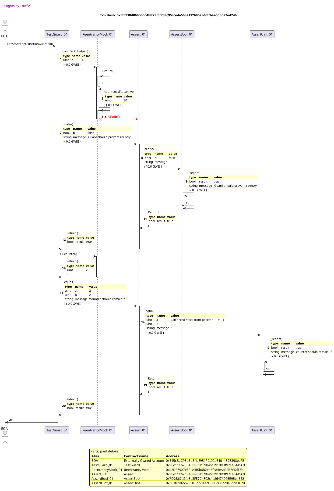

